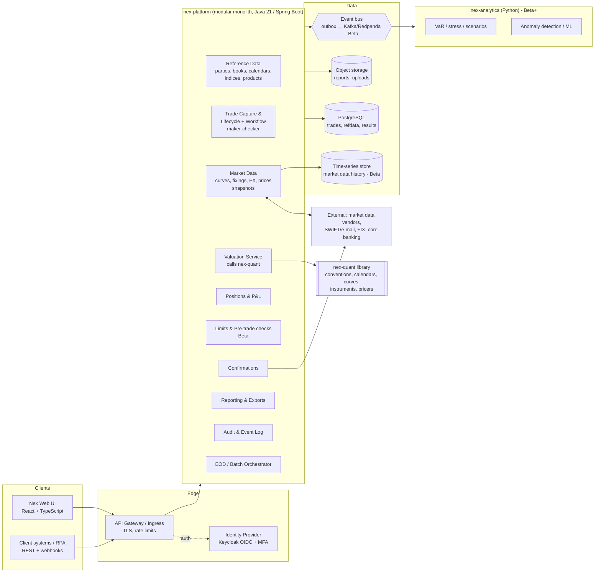
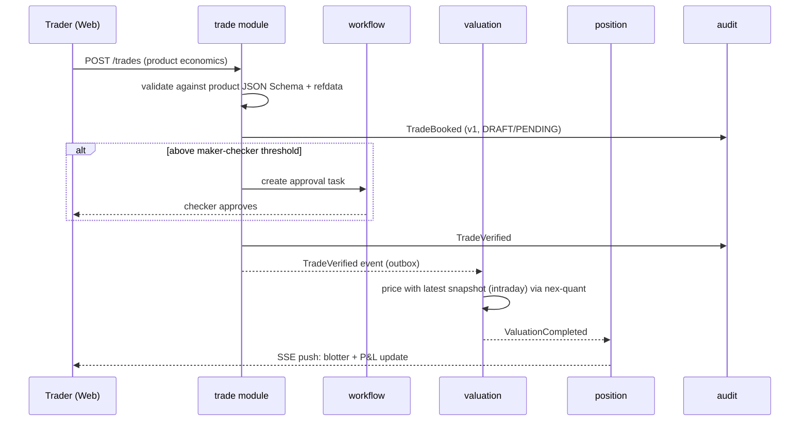
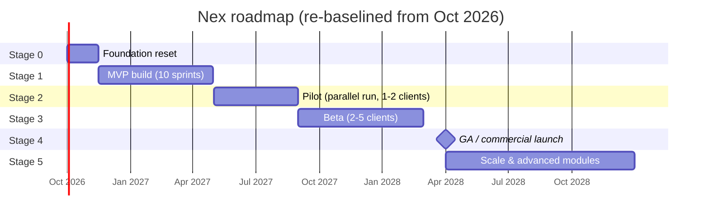

# Nex — Architecture Plan & Delivery Roadmap to MVP and Beyond

| | |
|---|---|
| **Document** | Nex guiding document: target architecture, current-state assessment, staged roadmap, MVP plan |
| **Source inputs** | *ATS SME Trading Platform — Investor Business Plan V1.0* and the `ATS` repository as of 24 Sep 2026 (commit `aa8ce23`) |
| **Audience** | Founders, product owner, engineering team, prospective pilot clients, investors (technical due diligence) |
| **Status** | Draft v0.1 for review |

---

## 0. How to use this document

1. **Section 1** restates what the business plan says we are building, so engineering decisions can be traced back to it.
2. **Section 2** is an honest assessment of where Nex actually is today. Every later section starts from this baseline.
3. **Sections 3–4** define the **target architecture** and how today's code moves into it.
4. **Section 5** is the **staged roadmap** (Stage 0 → Stage 5), with objectives, deliverables and exit gates.
5. **Section 6** is the **MVP playbook**: scope, acceptance criteria, sprint plan and definition of done.
6. **Sections 7–10** cover the team, engineering practices, risks, and **decisions leadership needs to make now**.

Keep this document in the repo and update it at each stage gate. Record architecture decisions as ADRs under `docs/adr/`. This document says *what* and *why*; the ADRs capture the detail of each decision.

---

## 1. The target outcome (from the business plan)

**Vision.** A cloud-native, cross-asset trading and risk platform for regional and mid-size banks, brokers and asset managers. It offers roughly *"80% of enterprise functionality with 20% of the complexity"* at a fraction of the cost of Murex, Calypso/ION or Finastra. It is sold as tiered SaaS and is built for local-market compliance, which global vendors are slow to support.

> Note: the plan contains an editorial comment asking to align wording. The target customer is *financial institutions that cannot justify tier-1 systems* (regional banks, brokers, asset managers), with room for smaller players. This document follows that wording.

**Capabilities the plan commits to (end state):**

| Capability | Plan commitment |
|---|---|
| Multi-asset trade capture | FX, equities, fixed income, money markets and vanilla derivatives in one unified model. New instruments are added by configuration, not code |
| Real-time P&L and risk | Event-driven recalculation on trade or price change; on-demand Greeks and VaR |
| STP and confirmations | Auto-generated confirmations (e-mail/SWIFT), affirmation/matching, settlement instructions, FIX/SWIFT integration |
| Compliance by design | RBAC, maker-checker, pre-trade limits, a complete audit trail, encryption, POPIA/GDPR, regulatory extracts |
| Reporting | Configurable management, client and regulatory reports; PDF/Excel export; later, NLG commentary |
| Modern UX | Web-based, responsive, real-time push (WebSockets), multi-currency and multi-language |
| Optional modules | AI anomaly detection, ML insights, RPA-friendly APIs, DLT-ready, crypto-agile (post-quantum) security |
| Technology | Cloud-native microservices, Docker/Kubernetes, cloud-agnostic, Java/.NET core plus Python analytics, React/Angular UI, SQL plus a time-series store, open APIs, SOC 2, CI/CD |

**Phases and commercial model in the plan:**

| Phase | Plan date (as written) | Scope | Commercial link |
|---|---|---|---|
| Phase 1 — MVP | "Mid-2025" / "2026" (the plan is inconsistent) | Trade capture for a limited asset set, positions, P&L, confirmations, EOD reports, user management, audit logging | 1–3 pilot clients, free or discounted |
| Phase 2 — Beta | "Late 2025 – mid 2026" / "end 2026" | More asset classes, basic VaR/Greeks, pre-trade limits, full audit trail, workflow automation, localisation; 2–5 beta clients | ~10 clients, ~$2M ARR by end of year 2 |
| Phase 3 — Full launch | Early 2027 | All major asset classes, stress testing, full reporting suite, AI/RPA modules, SOC 2, scale testing | 25+ clients, $7M+ ARR |

**Funding assumption:** $2–3M over 18–24 months for an 8–12 FTE team, compliance and security, and go-to-market.

---

## 2. Where Nex is today (current-state assessment, 24 Sep 2026)

### 2.1 Summary

Nex is at a **"Stage 0 — prototype / domain foundations"** level. The repository holds a promising start on the **quantitative domain layer** (conventions, calendars, cashflows, curves) and a **JavaFX desktop mock-up** of trade capture. It does not yet have a build system, persistence, services, authentication, tests or a running valuation path. **The codebase does not compile in its current state.**

Measured against the business plan, the MVP ("Phase 1") has **not** been reached. The plan's dated milestones (MVP 2025/2026, Beta 2026) have slipped and need to be re-baselined (see §5 and Decision D1).

### 2.2 Inventory

| Area | What exists | Maturity |
|---|---|---|
| **Repository** | ~80 files and ~6.3k lines of Java in 1 commit. IntelliJ `.iml` project, Java 21 | Early |
| **Build & dependencies** | No Maven or Gradle. Libraries (JavaFX SDK, Jackson 2.15, Apache POI 5.4, commons-collections4) are referenced by paths *outside* the repo (e.g. `C:\Program Files\JavaFXsdk`) | ❌ Not reproducible |
| **Conventions** (`com.ats.pricing.tools`) | Day counts (Act/360, Act/365, Act/Act ISDA, 30/360 US), Modified Following, date intervals | ✅ Good foundation, untested |
| **Foundation types** (`com.ats.pricing.foundation`) | `Currency`, `Payment`, `CashFlow`, `TimePeriod`/`ReferenceTimePeriod` tenors, `BusinessCenter` (ZAJO, USNY, GBLO), `BusinessDayCalendar` | 🟡 Useful; some classes were ported from a larger codebase and reference missing types |
| **Numerics & market data** (`com.ats.math`, `com.ats.pricing.marketData`) | `Interpolator1D`/linear interpolation, `DateBasedSurface1D` (1.5k lines, boundary handling, scenario hook), `InterestRateCurve` | 🟡 Strong design intent, does not compile (missing `Compounding`, `Entity`, `InterestRateSource`; mixes `Date` and `LocalDate`) |
| **Instruments** | `OvernightIndexSwap` (fields plus partial valuation), `OvernightIndexSwapFactory`, `InstrumentType` | ❌ Syntax errors; valuation references an undefined context |
| **Prototype valuation** (`ats.*`) | Fixed leg, floating leg and historical SOFR floating leg; flat and interpolated discount curves; CSV/JSON loaders; `OISValuationRunner` | 🟡 Proves the OIS PV concept; API mismatch (`yearFraction` vs `calculateDayCountFraction`); sample data files are malformed or missing |
| **Trade capture UI** (JavaFX) | Main window, module tabs (Trade Capture / Market Data / Reports), dynamic form per trade type (OIS, Bond, Loan) with preview | 🟡 Mock-up only: Save and Valuation buttons are no-ops, there is no validation, and the trade object is built before the user edits it |
| **Reference data** | Sample counterparties, trading books, holidays and SOFR fixings (JSON/CSV); `Counterparty`, `TradingBook`, `CounterpartyRole` | 🟡 Good seed for a reference-data module |
| **Scenario / risk** | `ScenarioOperator` / `ScenarioOperation` interfaces (shift logic commented out) | ⚪ Placeholder |
| **Persistence, APIs, auth, audit, tests, CI, deployment** | None | ⚪ Not started |

### 2.3 Specific technical debt found

These are the concrete items Stage 0 must clear:

1. **Compilation blockers.**
   - `OvernightIndexSwap.java` has unbalanced braces and references undeclared `context`, `CashFlows`, `discountingSource` and `includeCapitalPayment`.
   - `InterestRateCurve` references the missing types `Compounding` and `Entity`.
   - `CashFlow.discount(..)` references the missing types `InterestRateSource` and `InterestRate`.
   - `ReferenceTimePeriod` has a recursive constructor and extends a missing Hibernate-style `ImmutableVarCharUserType`.
   - `FixedLeg` and `HistoricalFloatingLeg` call `yearFraction(..)`, but `DayCountConvention` defines `calculateDayCountFraction(..)`.
2. **Layering inversion.** The pricing layer depends on the UI: `com.ats.pricing.tools.ContingentDateInterval` imports `ats.display.TradeFormFactory`. The quant library must never depend on the presentation layer.
3. **Duplicated code.**
   - Two `TradeFormFactory` classes (one empty)
   - Two `BusinessDayCalendar` classes
   - Two `DayCountConventionType` enums
   - `TitleBar`/`UIHeader` and `BottomTabManager`/`UITabManager`
   - Two copies of the logo
4. **Data file defects.**
   - `holidays.csv` uses `dd/MM/yyyy`, but the loader parses ISO dates.
   - `sofr_fixings.csv` has each whole line quoted, so parsing fails.
   - `OISValuationRunner` expects a `discount_curve.csv` that doesn't exist.
   - Resources are loaded by relative file path, so they only work from one working directory.
5. **Hard-coded identity.** "Logged in as: trader_user", and the trader defaults to "Champion".
6. **Free-text trade fields.** Tenors, day counts, indices and dates are typed as free text in `TextField`s, with no typed domain model behind them.
7. **No tests.** The day-count, calendar and interpolation code has no tests, even though it is ideal for golden tests.

### 2.4 Strengths to preserve

- **Domain instinct is right.** Cashflow/payment/leg modelling, business centres, tenor parsing, curve abstractions with scenario hooks, and trade header fields (book, counterparty, CSA, funding status, risk definition) match how professional systems are structured.
- **Local-market orientation.** ZAR, the Johannesburg business centre and local counterparties are already there. This is the plan's stated differentiator against Western-centric vendors.
- **Java 21 core.** This matches the plan's "Java/.NET core" choice and has a deep hiring pool.

---

## 3. Target architecture

### 3.1 Architecture principles

| # | Principle | Why it matters for Nex |
|---|---|---|
| P1 | **Modular monolith first, microservices when proven necessary** | A 5–8 person team cannot run 10+ microservices well. Strict module boundaries give most of the benefit. Extract services (pricing/risk grid first) only when scaling or team size requires it. This still fulfils the plan's "microservices-ready" claim |
| P2 | **The quant library is pure Java and framework-free** | `nex-quant` is the core IP. It must be testable in isolation, reusable in batch, API and grid contexts, and never import UI or persistence code |
| P3 | **Trades are immutable, versioned events** | Amendments create new versions and every change is an event. This makes the audit trail, maker-checker and "as-of" reporting natural rather than bolted on (compliance by design) |
| P4 | **Products are configuration** | Product definitions (fields, validation, defaults, pricer binding) are metadata (JSON Schema), so new instruments need little UI code. This is what the plan promises clients |
| P5 | **Tenant-aware from day one** | Every table, event and cache key carries `tenant_id`, even when a pilot runs single-tenant |
| P6 | **API-first** | The web UI uses the same public, versioned REST/stream APIs that clients and RPA bots will use (plan: open APIs, RPA-ready) |
| P7 | **Secure and observable by default** | OIDC/MFA, encryption, structured logs, metrics and traces are part of the skeleton, not a later phase |
| P8 | **Local compliance as a feature** | South African calendars and indices (ZARONIA, JIBAR fallback), JSE bond conventions, POPIA and Prudential Authority/FSCA IT and cyber standards are first-class, not bolt-ons |

### 3.2 Logical architecture



### 3.3 Module responsibilities (bounded contexts)

| Module | Owns | Key APIs / events | Stage |
|---|---|---|---|
| **identity** | Users, roles, permissions, tenant membership (delegates authentication to Keycloak) | `GET /me`, role checks | MVP |
| **refdata** | Counterparties, legal entities, books/portfolios, currencies, business centres and holiday calendars, rate indices (ZARONIA, SOFR, JIBAR), product definitions | CRUD + `RefDataChanged` | MVP |
| **trade** | Trade header and product economics, versions, lifecycle state machine, maker-checker workflow | `POST /trades`, `/amend`, `/cancel`, `/approve`; `TradeBooked`, `TradeAmended`, `TradeCancelled` | MVP |
| **marketdata** | Curve quotes, fixings, FX rates and bond prices by business date; upload, validation, snapshot/freeze | `POST /marketdata/upload`, `MarketDataSnapshotSealed` | MVP |
| **valuation** | Builds pricing context (curves, fixings) from snapshots, invokes `nex-quant`, stores PV, cashflows and sensitivities | `POST /valuations/run`, `ValuationCompleted` | MVP |
| **position** | Positions by book/instrument/currency, daily P&L (MTM, realised/unrealised), P&L explain (basic) | `GET /positions`, `/pnl` | MVP |
| **confirmation** | Confirmation templates, generation (PDF/e-mail), status tracking | `ConfirmationSent` | MVP (e-mail/PDF); SWIFT in Beta |
| **reporting** | Blotter, positions, P&L, cashflow and audit reports; CSV/XLSX/PDF export; scheduled reports | `GET /reports/{id}` | MVP |
| **audit** | Append-only, hash-chained log of every command and data change, with who/when/what/before/after | Consumes all events | MVP |
| **eod** | Business-date roll, market-data freeze, revaluation, P&L snapshot, report generation | Scheduler | MVP |
| **limits** | Counterparty credit and concentration limits, pre-trade check, breach workflow | `LimitBreached` | Beta |
| **risk** (Python) | DV01/Greeks aggregation, historical VaR, stress and scenarios (uses the `ScenarioOperator` concept) | Batch + on demand | Beta |
| **integration** | FIX (QuickFIX/J), SWIFT MT/MX via a partner, vendor feeds, core-banking exports | Adapters | Beta/GA |
| **ai / rpa** | Anomaly detection, ML insights, RPA hooks | Add-on | GA |

Boundaries are enforced in code with **Spring Modulith** or **ArchUnit** tests: modules talk only through published interfaces and events, never through each other's tables.

### 3.4 Technology decisions (recommended)

| Concern | Recommendation | Rationale / alternatives |
|---|---|---|
| Core language | **Java 21 (LTS)**, moving to Java 25 LTS at GA | Existing code; plan says Java/.NET; large talent pool |
| Build | **Gradle (Kotlin DSL) multi-module** | Reproducible builds and dependency locking. Maven is equally fine; pick one in Stage 0 |
| Application framework | **Spring Boot 3.x + Spring Modulith** | Mature, easy to hire for; Modulith enforces module boundaries and supports the event outbox. Quarkus is a valid alternative |
| Quant library | **`nex-quant`** (own code, cleaned up) behind a `PricingEngine` interface. **Evaluate OpenGamma Strata (Apache-2.0)** as the calibration/pricing backend for rates and FX | Strata already implements OIS/IRS/FX/bond pricing and curve calibration. Using it behind our interface could cut MVP pricing effort by months while we keep the domain model, SA conventions and product configuration as our IP. Validate everything against QuantLib |
| Database | **PostgreSQL 16+** (managed). JSONB for product economics, validated by JSON Schema | ACID for trades (plan requirement), strong JSON support, cheap |
| Market-data history | PostgreSQL (MVP) → TimescaleDB or a column store (Beta) | Avoid a second datastore until volume needs it |
| Messaging | **Transactional outbox in PostgreSQL** (MVP) → **Kafka/Redpanda** (Beta, when analytics and multi-tenant scale arrive) | Guarantees no lost or duplicated trade events without operating Kafka on day one |
| Front-end | **React + TypeScript**, **AG Grid** for blotters, a component library (e.g. MUI/Mantine), **Server-Sent Events/WebSocket** push | Plan specifies a web SPA with real-time push. Retire JavaFX (Decision D3) |
| Forms | **JSON Schema-driven dynamic forms** generated from product definitions | Replaces hand-coded per-product JavaFX forms and delivers "new instrument without code" |
| Identity | **Keycloak** (OIDC/SAML, MFA, SSO to client AD/Entra ID) | Open source, bank-friendly SSO; managed Entra ID/Cognito are alternatives |
| Documents | Apache POI (XLSX — already a dependency), OpenPDF/JasperReports (PDF) | Reuse existing POI knowledge |
| Analytics | **Python 3.12 + FastAPI**, NumPy/Pandas, scikit-learn | Plan: Python for risk/ML; introduced in Beta |
| Packaging and runtime | Docker images; **Azure Container Apps / AWS ECS** for pilot → **Kubernetes (AKS/EKS) + Helm** from Beta | Kubernetes has high operating cost for a small team; adopt it when multi-tenant SaaS needs it |
| Cloud region | **In-country South African region** (Azure South Africa North, Johannesburg / AWS af-south-1, Cape Town) | Data residency and SA regulator expectations for material outsourcing and cloud; choose with the pilot bank (Decision D5) |
| Infrastructure as code | **Terraform** | Cloud-agnostic, as the plan claims |
| CI/CD | **GitHub Actions**: build, test, SAST (CodeQL/Semgrep), dependency and container scanning, SBOM, deploy to dev/UAT | The repo is already on GitHub |
| Observability | **OpenTelemetry** → Grafana/Prometheus/Loki (or cloud-native equivalents) | Needed to back SLA and SOC 2 claims |
| Secrets & keys | Cloud KMS / Key Vault, envelope encryption, no secrets in the repo | SOC 2 and POPIA |

### 3.5 Data architecture essentials

**Trade model (bitemporal and versioned):**

```
trade            (tenant_id, trade_id, version, status, product_type, book_id, counterparty_id,
                  trade_date, trader_id, economics JSONB, valid_from, valid_to,
                  recorded_at, recorded_by, approved_by, supersedes_version)
trade_event      (append-only: event_id, tenant_id, trade_id, version, type, payload, actor, ts, prev_hash, hash)
```

- **Lifecycle:** `DRAFT → PENDING_APPROVAL → VERIFIED → CONFIRMED → (MATURED | TERMINATED)`. `CANCELLED` is reachable before confirmation; an amendment creates `version + 1`. The maker-checker threshold is configured per book and product.
- **Today's `TransactionInfo`** becomes the typed `TradeHeader`, with references (`BookId`, `CounterpartyId`, `UserId`) instead of free-text combo values.
- **Market data:** `(tenant_id, business_date, snapshot_id, data_type, key, value, source, status)`. A snapshot is **sealed** at EOD, and valuations always reference a sealed snapshot, so results are reproducible (an audit requirement).
- **Results:** `valuation_result (trade_id, trade_version, snapshot_id, measure, currency, value, run_id)`. P&L is derived from results and never overwritten.
- **Audit:** every command (who, what, before/after, IP, reason), hash-chained for tamper evidence and retained per regulation. Exportable for auditors.

### 3.6 Security, compliance and multi-tenancy

| Topic | MVP | Beta | GA |
|---|---|---|---|
| Authentication | Keycloak OIDC, MFA mandatory | SSO federation to client IdP | SAML/SCIM provisioning |
| Authorisation | RBAC (Trader, Middle Office, Risk, Ops, Admin, Auditor read-only); maker-checker | Book-level entitlements, four-eyes on static data | Attribute-based policies |
| Tenancy | **Dedicated deployment per pilot** (simplest to approve with a bank), `tenant_id` everywhere | Pooled multi-tenant, schema-per-tenant | Tiered: pooled (Starter/Standard), dedicated/private cloud (Enterprise) |
| Data protection | TLS 1.2+, AES-256 at rest, KMS keys, POPIA data map | Per-tenant keys, data retention policies | Customer-managed keys (Enterprise), crypto-agility plan (the plan's "quantum resilience") |
| Assurance | Threat model, SAST/dependency scans, external pen test before pilot go-live | SOC 2 Type I, DR test | SOC 2 Type II, ISO 27001 (optional) |
| Resilience | Daily backups, PITR, RPO ≤ 15 min, RTO ≤ 4 h | Multi-AZ, RTO ≤ 1 h | Cross-region DR |
| Regulatory alignment (SA) | POPIA; map controls to the Prudential Authority/FSCA joint standards on IT governance and on cybersecurity and cyber resilience, and to SARB cloud/outsourcing guidance (confirm exact instruments with a compliance advisor) | Regulatory extracts per pilot need | Multi-jurisdiction packs (EU GDPR/MiFID II, etc.) |

### 3.7 Key runtime flows

**Trade booking (MVP):**



**End of day (MVP):** close business date → seal market-data snapshot → revalue all live trades → compute daily P&L and positions → generate standard reports → roll the business date. Each step is idempotent and restartable, and results are stamped with `run_id`.

---

## 4. Moving today's code into the target structure

### 4.1 Target repository layout

```
ats/                               (repo; product name "Nex")
├── settings.gradle.kts
├── nex-quant/                     pure Java library (no Spring, no UI)
│   ├── core/          Currency, Payment, CashFlow, TimePeriod, Tenor
│   ├── calendar/      BusinessCenter, HolidayCalendar, BusinessDayConvention
│   ├── daycount/      Act360, Act365F, ActActISDA, 30/360
│   ├── math/          Interpolator1D, LinearInterpolator (+ log-linear, monotone cubic)
│   ├── marketdata/    DateBasedSurface1D, DiscountCurve, ForwardCurve, FixingSeries
│   ├── product/       OIS, IRS, FXForward, FixedRateBond, Deposit/Loan
│   ├── pricer/        OisPricer, FxForwardPricer, BondPricer, CurveCalibrator
│   └── scenario/      ScenarioOperator (parallel/bucket shifts)
├── nex-platform/                  Spring Boot modular monolith
│   └── src/main/java/com/ats/nex/{identity,refdata,trade,marketdata,valuation,
│                                   position,confirmation,reporting,audit,eod}
├── nex-web/                       React + TypeScript SPA
├── nex-analytics/                 Python (from Beta)
├── infra/                         Terraform, Helm/compose, environment config
├── docs/                          this document, ADRs, runbooks, API docs
└── legacy/                        current JavaFX prototype, frozen; deleted after MVP
```

### 4.2 Package-by-package migration map

| Current package / file | Destination | Action |
|---|---|---|
| `com.ats.pricing.tools.*` (day counts, Modified Following, `DateInterval`) | `nex-quant/daycount`, `calendar` | Keep. Add golden tests (ISDA examples). Remove the UI dependency from `ContingentDateInterval` |
| `com.ats.pricing.foundation.*` | `nex-quant/core`, `calendar` | Keep and fix. Merge the two `BusinessDayCalendar`s. Drop the Hibernate `UserType` remnant. Define `ParsingException` in quant |
| `com.ats.math.numeric.*` | `nex-quant/math` | Keep. Pick one of `LinearInterpolator` or `LinearInterpolatorAsRecord` |
| `com.ats.pricing.marketData.*` | `nex-quant/marketdata` | Fix: add `Compounding`, drop `Entity` (use tenant context outside quant), standardise on `LocalDate` |
| `com.ats.pricing.instruments.OvernightIndexSwap` | `nex-quant/product` + `pricer` | **Rewrite** as an immutable product definition plus a separate pricer (compounded-in-arrears, lookback/lag, payment lag). The current file is not salvageable as-is |
| `ats.FixedLeg`, `FloatingLeg`, `HistoricalFloatingLeg`, `MarketDiscountCurve`, `OISValuationRunner` | `nex-quant/pricer` (logic), tests (runner scenario) | Fold the logic into `OisPricer`; turn the runner into an integration test with fixed fixtures |
| `ats.*Loader` (CSV/JSON) | `nex-platform/marketdata` upload adapters | Rewrite with validation. Fix sample files (ISO dates, unquoted CSV) |
| `com.ats.pricing.enums.*`, `com.ats.tradingsystem.enums.*` | `refdata` (seed data) / `nex-quant` enums | Replace sample enums (`SampleCounterparties`, `SamplePortfolios`) with reference-data tables |
| `TransactionInfo` | `trade` → `TradeHeader` | Typed IDs, status enum, immutable, versioned |
| `Counterparty`, `TradingBook`, `CounterpartyRole`, `resources/*.json` | `refdata` | Entities + Flyway seed scripts |
| `ats.display.*`, `com.ats.tradingsystem.ui.*`, `MainApp` | `legacy/` → UX reference for `nex-web` | Freeze. Reuse the field lists as the first product JSON Schemas (OIS, Bond, Loan) |
| `ScenarioOperator`, `ScenarioOperation` | `nex-quant/scenario` | Implement ABSOLUTE/RELATIVE/VALUE shifts in Beta |

---

## 5. Staged roadmap

### 5.1 Re-baselined timeline

The business plan's dates are no longer achievable from the current baseline, so the stages below are re-baselined from **October 2026**. They assume a core team of **5–7 people from November 2026**, growing toward 8–12 by Beta (see §7). If funding and hiring land earlier or later, shift the stages accordingly.



| Stage | Window | Headline outcome | Plan phase |
|---|---|---|---|
| **0 — Foundation reset** | Oct – mid-Nov 2026 | Code compiles, builds in CI and is tested; architecture skeleton; pilot partner signed | (pre-MVP) |
| **1 — MVP build** | mid-Nov 2026 – Apr 2027 | A deployable, secure web platform covering the MVP scope (§6) | Phase 1 |
| **2 — Pilot** | May – Aug 2027 | MVP live in UAT/production with 1–2 design partners; 20-day clean parallel run | Phase 1 validation |
| **3 — Beta** | Sep 2027 – Feb 2028 | More asset classes, risk, limits, multi-tenant SaaS, SOC 2 Type I, 2–5 clients | Phase 2 |
| **4 — GA** | Apr 2028 | Commercial launch: tiers, onboarding at scale, SOC 2 Type II in progress | Phase 3 |
| **5 — Scale** | 2028+ | AI/RPA modules, integrations, new regions, service extraction | Phase 3+ |

**Accelerated scenario:** if the team reaches 8+ by January 2027 *and* Strata is adopted for pricing (D6), MVP can land around **March 2027**, Beta around **Q4 2027** and GA around **Q1 2028**.

---

### Stage 0 — Foundation reset (≈6 weeks, 3 sprints)

**Objective:** turn the prototype into a professional, buildable codebase and lock the key decisions so Stage 1 can run at full speed.

| Workstream | Deliverables |
|---|---|
| Build & hygiene | Gradle multi-module build; dependencies pinned (Jackson, POI, JUnit 5, AssertJ); JavaFX moved to `legacy/` with the OpenJFX Gradle plugin (or excluded); `.editorconfig`, formatter (Spotless), static analysis (Error Prone/SpotBugs) |
| Make it compile | Every item in §2.3 fixed or quarantined; `ContingentDateInterval` UI dependency removed; duplicates consolidated |
| Quant foundations | `nex-quant` created from §4.2. **Golden tests**: day counts (ISDA examples), calendars (ZAJO/USNY/GBLO 2025–2030), interpolation, tenor parsing. Target ≥ 90% line coverage on `nex-quant` |
| Pricing spike (1 week) | Build a 5Y ZAR OIS and a USD SOFR OIS with (a) own code and (b) OpenGamma Strata. Compare with QuantLib to within 0.1 bp and write **ADR-0003**, which makes the call |
| CI/CD | GitHub Actions: build + test on every PR, CodeQL, Dependabot, secret scanning, branch protection on `main` |
| Architecture | ADRs 0001–0008 (modular monolith, Spring Boot, PostgreSQL + outbox, web UI replaces JavaFX, Keycloak, cloud/region, tenancy for pilot, product-as-schema). Walking skeleton: `nex-platform` with one endpoint, Flyway, Keycloak login, `nex-web` shell, docker-compose for local dev |
| Product & UX | MVP scope confirmed with the pilot (§6). Wireframes for blotter, trade ticket, positions/P&L, market-data upload and approvals. Domain glossary |
| Business | **Signed design-partner LOI** with at least one pilot bank or broker. Collect their sample trades, EOD spreadsheet and confirmation templates; these become the MVP acceptance test fixtures |
| Cloud | Accounts/subscription in the SA region, Terraform skeleton, dev environment |

**Exit gate (Stage 0 → 1):** `main` builds green in CI from a clean clone; `nex-quant` tests pass; walking skeleton is deployed to the dev cloud environment with login; ADRs are approved; pilot LOI is signed and fixtures are received.

---

### Stage 1 — MVP build (≈10 two-week sprints)

**Objective:** deliver the MVP defined in §6 as a secure, deployable web platform. The sprint plan is in §6.5.

**Exit gate (Stage 1 → 2):** all MVP acceptance criteria (§6.3) pass in the UAT environment using the pilot's fixtures. External pen test shows no open critical or high findings. Runbooks exist for EOD, backup/restore and incident response. A restore from backup has been demonstrated.

---

### Stage 2 — Pilot (≈4 months)

**Objective:** prove value with real users and data, and turn the pilot into a reference case, as the plan's go-to-market requires.

- Onboard 1–2 design partners (e.g. through The League network): data migration of open trades and static data, user training, SSO set-up.
- **Parallel run.** The pilot's existing process (spreadsheets or a legacy tool) runs alongside Nex. The daily reconciliation report is Nex vs the client's figures.
- Weekly feedback sessions; the backlog is re-prioritised every sprint. Small fixes release every two weeks.
- Instrument and product analytics: time to book a trade, EOD duration, errors caught by maker-checker.
- Start the SOC 2 readiness programme (policies, access reviews, change management evidence from CI).
- Produce a case study with quantified outcomes (e.g. "EOD P&L from 3 hours to 10 minutes", "zero untracked amendments").

**Exit gate:** 20 consecutive business days of parallel run with P&L within agreed tolerance; pilot sign-off; decision to convert to a paid Starter/Standard subscription; case study approved.

---

### Stage 3 — Beta (≈6 months)

**Objective:** broaden functionality and harden the SaaS platform for 2–5 clients. This matches the plan's Phase 2.

| Area | Beta scope |
|---|---|
| Products | Vanilla IRS (ZARONIA/JIBAR-fallback, SOFR), FRAs, FX swaps, money-market deposits/loans, fixed-rate govt bonds with JSE conventions (books-closed/ex-coupon) if not in MVP, listed equities (positions and P&L), simple FX options (Black-Scholes) |
| Risk | DV01/PV01 by bucket, FX delta, Greeks for options; historical VaR (Python analytics service); scenario shifts via `ScenarioOperator` |
| Compliance | Pre-trade credit and concentration limits with breach workflow; four-eyes on static data; audit reports for regulators and auditors |
| Market data | Vendor EOD feed integration (one vendor), intraday FX/rates polling, curve calibration from market quotes, time-series store |
| Workflow automation | Rule-based approvals, EOD scheduling, e-mail alerts; first RPA-friendly endpoints (bulk export/import APIs) |
| Integration | SWIFT confirmation (MT300/MT320) through a partner/bureau; generic CSV/API export to core banking/GL |
| Platform | Pooled multi-tenancy (schema-per-tenant), Kubernetes + Helm, Kafka/Redpanda event bus, per-tenant encryption keys, multi-AZ, DR test |
| Localisation | Multi-currency reporting with FX conversion, locale formats; i18n framework (translations when a client needs them) |
| Assurance | SOC 2 Type I report; load test (e.g. 50k live trades, 100 concurrent users, p95 < 1 s) |

**Exit gate:** 2+ paying clients live; SOC 2 Type I achieved; performance and DR targets met; tier packaging agreed (§5.2).

---

### Stage 4 — General availability (target Apr 2028)

- Commercial packaging live: Starter / Standard / Enterprise tiers with feature flags per module and usage metering.
- Self-service tenant provisioning, onboarding playbook (≤ 6 weeks from contract to go-live), customer-facing documentation, API portal, support desk with SLAs.
- Full reporting suite with a template library and report designer.
- Stress testing and scenario library; regulatory report packs per pilot jurisdiction.
- SOC 2 Type II observation period under way; cyber insurance in place.
- Marketplace listings (AWS/Azure) and reseller and partner certification (from the plan's GTM section).

### Stage 5 — Scale & advanced modules (2028+)

- **AI anomaly detection** add-on: unusual trades, cancellation spikes, off-market prices, built on the audit and event history already collected since MVP.
- **ML insights**, **NLG report commentary**, pre-built **RPA** bots (reconciliations, regulator portal uploads).
- Commodities and more complex derivatives; FIX order routing for execution.
- Extract the **pricing/risk grid** as a separate horizontally-scalable service; extract other modules only where load or team structure justifies it.
- DLT/tokenised-asset adapters and a crypto-agility (post-quantum) roadmap, as the plan's forward-looking claims describe.
- New jurisdictions (reporting packs, calendars, indices) through partners.

### 5.2 Modules mapped to commercial tiers

| Module | Starter | Standard | Enterprise | Available from |
|---|:-:|:-:|:-:|---|
| Trade capture, blotter, refdata, audit | ✅ | ✅ | ✅ | MVP |
| Positions, P&L, EOD, standard reports | ✅ | ✅ | ✅ | MVP |
| Confirmations (PDF/e-mail) | ✅ | ✅ | ✅ | MVP |
| Maker-checker workflow | ✅ | ✅ | ✅ | MVP |
| Additional asset classes | limited | ✅ | ✅ | Beta |
| Limits & pre-trade checks | — | ✅ | ✅ | Beta |
| Risk (sensitivities, VaR, stress) | — | ✅ | ✅ | Beta/GA |
| SWIFT/FIX/vendor integrations | add-on | add-on | ✅ | Beta+ |
| AI anomaly detection / ML / RPA | — | add-on | add-on | GA+ |
| Dedicated / private-cloud deployment | — | — | ✅ | GA |

---

## 6. MVP playbook — how we get to MVP

### 6.1 MVP definition

> **Nex MVP** is a secure, cloud-hosted, web-based platform that lets a treasury or trading desk **capture, approve, value and report** its FX and interest-rate trades end to end, with a complete audit trail. It replaces the spreadsheet-based EOD P&L process for at least one pilot desk.

The goal is to prove the core loop — **book → approve → value → position/P&L → report → audit** — on real client data. It is not to cover every asset class.

### 6.2 Scope

**Asset classes (Decision D2).** The plan's Phase 1 says "FX and equities". The existing code, the SA treasury market and the ZARONIA transition all point to rates. **Recommendation:**

| Product | MVP | Why |
|---|---|---|
| FX spot and forward | ✅ | Every treasury desk has it; simple pricing; high demo value |
| OIS (ZARONIA, SOFR) | ✅ | Existing prototype and domain work; topical because of the JIBAR→ZARONIA transition |
| Fixed-rate government bond (buy/sell, accrued, clean/dirty) | ✅ *stretch* | Common holding for regional banks; the JavaFX form already exists |
| Money-market deposit/loan | ✅ *stretch* | Simple, and covers the existing "Loan Trade" form |
| Equities, IRS vs JIBAR, options | ❌ → Beta | Keep the MVP small |

Confirm the final list with the pilot client in Stage 0. Their actual trading mix wins.

**In scope:**

1. **Access & security:** Keycloak login with MFA; roles Trader, Middle Office (checker), Risk/Finance (read + EOD), Admin, Auditor (read-only); tenant-scoped data.
2. **Reference data:** counterparties, books/portfolios, currencies, calendars (ZAJO, USNY, GBLO), indices (ZARONIA, SOFR), products. Admin UI plus CSV bulk import; changes audited.
3. **Trade capture:** schema-driven ticket per product with validation (dates vs calendar, tenor → maturity, required fields); save as draft; book; amend (new version); cancel with a reason; clone. Trade blotter with filters, live updates and export.
4. **Workflow:** maker-checker when notional exceeds a per-book threshold; approval inbox; rejection with a reason.
5. **Market data:** upload FX rates, OIS/deposit quotes or discount factors, fixings and bond prices through CSV/XLSX templates. Validation (gaps, stale values, outliers) with a report; snapshot per business date; manual seal at EOD.
6. **Valuation:** PV and cashflows (projected and realised) for each MVP product via `nex-quant`. OIS curve built from quotes (or from supplied discount factors if calibration moves to Beta). DV01 for OIS and bonds. Intraday revaluation on trade events and market-data uploads.
7. **Positions & P&L:** positions by book, instrument and currency. Daily P&L = ΔMTM + realised cashflows, split into new-trade and existing-trade P&L. P&L in trade currency and reporting currency (ZAR).
8. **EOD process:** one-click or scheduled EOD with a progress screen: seal snapshot → revalue → P&L → reports → roll the date. Idempotent re-run.
9. **Confirmations:** PDF confirmation from a template per product; e-mail to the counterparty address from refdata; status (Generated/Sent).
10. **Reports:** blotter, positions, daily P&L, cashflow ladder, market-data snapshot, audit trail. Export to XLSX/CSV/PDF.
11. **Audit:** every create/update/approve/login/export is recorded with before/after values; searchable audit screen; export.
12. **Operations:** health dashboards, structured logs, alerting on EOD failure, daily backups with PITR.

**Explicitly out of scope for MVP:** VaR and Greeks beyond DV01, credit limits, SWIFT/FIX, live vendor feeds, multi-tenant pooling, mobile UI, i18n translations, AI/RPA, report designer.

### 6.3 Acceptance criteria (MVP "done")

| # | Criterion | Measure |
|---|---|---|
| A1 | Pricing accuracy | OIS/FX forward/bond PVs match independent QuantLib (or pilot/Bloomberg) values within **0.5 bp** equivalent or **ZAR 100 per ZAR 100m notional** across the pilot's trade set |
| A2 | Workflow correctness | 100% of trades above the threshold require a distinct checker; no path books a trade without an audit event (automated test) |
| A3 | P&L reconciliation | EOD P&L per book reconciles to the pilot's figures within the agreed tolerance on 10 historical dates (fixture replay) |
| A4 | EOD performance | EOD for 10,000 live trades completes in **< 15 minutes** |
| A5 | UI responsiveness | p95 < 1 s for blotter load (5k rows, virtualised), ticket save and approval |
| A6 | Audit completeness | Every state change is reconstructable ("show me trade X as of date Y") |
| A7 | Security | MFA enforced; OWASP ASVS L2 checklist complete; external pen test with no open critical/high findings |
| A8 | Resilience | Backup restore demonstrated; RPO ≤ 15 min, RTO ≤ 4 h documented and tested |
| A9 | Usability | A pilot trader books each MVP product unaided after a 1-hour training session |

### 6.4 Non-functional baseline for MVP

- Availability 99.5% during business hours (06:00–20:00 SAST), with maintenance windows outside those hours.
- Data hosted in the SA cloud region; encryption in transit and at rest; no production data in dev or test.
- Every release goes through the CI pipeline with automated tests; no manual production changes.
- API documented with OpenAPI; versioned under `/api/v1`.

### 6.5 Sprint plan (2-week sprints, from mid-Nov 2026)

| Sprint | Dates (approx.) | Goal | Key stories |
|---|---|---|---|
| **S1** | 16 Nov – 27 Nov | Platform spine | Tenant context, identity roles, audit event infrastructure (outbox + hash chain), Flyway baseline, `nex-web` layout/navigation, CI deploy to dev |
| **S2** | 30 Nov – 11 Dec | Reference data | Counterparties, books, currencies, calendars, indices CRUD + CSV import + audit; admin screens |
| **S3** | 4 Jan – 15 Jan | Trade model | Product JSON Schemas (FX spot/fwd, OIS); trade aggregate, versions and lifecycle state machine; REST API; contract tests |
| **S4** | 18 Jan – 29 Jan | Trade UI | Schema-driven ticket, blotter (AG Grid) with SSE live updates, amend/cancel/clone, validation messages |
| **S5** | 1 Feb – 12 Feb | Workflow & market data | Maker-checker + approval inbox; market-data templates, upload, validation report, snapshots |
| **S6** | 15 Feb – 26 Feb | Valuation I | `PricingEngine` API; FX forward pricer; OIS pricer + curve build; valuation results store; golden tests vs QuantLib |
| **S7** | 1 Mar – 12 Mar | Positions & P&L | Position keeping, daily P&L, P&L screens, cashflow ladder |
| **S8** | 15 Mar – 26 Mar | EOD & reports | EOD orchestrator (idempotent), report generation XLSX/PDF/CSV, audit screen |
| **S9** | 29 Mar – 9 Apr | Confirmations & stretch products | PDF confirmations + e-mail; bond and/or deposit products (if confirmed); DV01 |
| **S10** | 12 Apr – 30 Apr | Hardening & UAT | Pilot fixture replay (A1/A3), performance test (A4/A5), pen-test fixes, runbooks, backup/restore drill, UAT sign-off |

December holidays are built in (a lighter S2 and a break until 4 Jan). If a sprint slips, cut the stretch products in S9 before any hardening work in S10.

### 6.6 Definition of Done (per story)

- Code reviewed by at least 1 other engineer; ArchUnit/Modulith boundary tests pass.
- Unit tests; `nex-quant` changes include golden tests with an independent reference value.
- API changes are reflected in OpenAPI; UI changes are checked against wireframes and accessibility basics.
- Audit events are emitted for every state change.
- Deployed to dev by CI; the product owner has accepted it in the demo.
- No new critical/high findings from SAST or dependency scans.

### 6.7 MVP test strategy

| Layer | Approach |
|---|---|
| Quant | Golden tests against QuantLib (a Python script generates fixtures in CI) and ISDA day-count examples; property-based tests (e.g. PV monotonic in rate) |
| Domain | Unit tests for lifecycle state machine and P&L maths |
| API | Spring Boot integration tests with Testcontainers (PostgreSQL, Keycloak); contract tests |
| UI | Playwright end-to-end: book → approve → EOD → report |
| Reconciliation | **Pilot fixture replay**: load the pilot's historical trades and market data, run EOD for N dates, diff against their P&L |
| Performance | Gatling/k6 scenarios for blotter, booking and EOD at 10k trades |
| Security | SAST, dependency/container scanning, ZAP baseline scan in CI, external pen test before pilot |

---

## 7. Team and resourcing by stage

| Role | Stage 0–1 (MVP) | Stage 2–3 (Pilot/Beta) | Stage 4+ (GA) |
|---|---|---|---|
| Product owner / domain BA (treasury and trading) | 1 | 1 | 1–2 |
| Tech lead / architect (hands-on) | 1 | 1 | 1 |
| Back-end Java engineers (1 with quant skills) | 2 | 3 | 4 |
| Front-end React engineer | 1 | 2 | 2 |
| QA automation engineer | 1 | 1 | 2 |
| DevOps / SRE | 0.5 (shared or contract) | 1 | 1–2 |
| UX designer | contract (Stage 0–S4) | contract | 0.5 |
| Security / compliance advisor | contract (threat model, pen test) | contract (SOC 2) | 0.5 + auditor |
| Quant / risk (Python) | — | 1 | 1 |
| Customer success / support | — | 0.5 | 2+ |
| **Total (FTE)** | **≈6.5–7** | **≈10–11** | **≈14–17** |

This follows the plan's hiring ramp: a lean 5–7 for MVP and 8–12 by launch. Keep the trade/valuation engine and architecture in-house (core IP). Contract out UX, pen testing, SWIFT connectivity and later RPA/ML, as the plan suggests.

---

## 8. Engineering practices

- **Branching:** trunk-based on `main` with short-lived feature branches and PRs; protected `main`; squash merges; conventional commit messages.
- **Environments:** `dev` (continuous) → `uat` (sprint releases, pilot testing) → `prod` (per-pilot). Promote immutable images; infrastructure only through Terraform.
- **Architecture Decision Records** in `docs/adr/NNNN-title.md`, one per significant decision (the §3.4 table seeds the first ADRs).
- **Quality gates in CI:** compile, unit and integration tests, coverage threshold on `nex-quant` (≥ 90%), boundary tests, CodeQL, dependency scan, container scan, SBOM.
- **Release cadence:** every sprint to UAT; to pilot production every sprint once stable (from Stage 2).
- **Documentation:** OpenAPI, runbooks (EOD, incident, restore), user guide per module. These double as SOC 2 evidence.
- **Security in the lifecycle:** threat model per new module; secrets only in the vault; least-privilege IAM; access reviews each quarter.

---

## 9. Delivery risks and mitigations

| Risk | Likelihood / impact | Mitigation |
|---|---|---|
| **Timeline credibility gap:** plan dates already passed while the code is pre-MVP | High / High | Re-baseline now (D1); update investor materials; report progress against stage gates, not dates |
| **Pricing accuracy** undermines trust | Med / High | Golden tests vs QuantLib from day one; consider Strata (D6); pilot fixture replay as a release gate |
| **Scope creep** from the pilot client | High / Med | Written MVP scope (§6.2); change requests go to the Beta backlog; the product owner owns the trade-offs |
| **Small team, key-person risk** (the domain/quant knowledge sits with 1–2 people) | High / High | Pair programming on `nex-quant`; ADRs and docs; fixtures encode domain knowledge; hire the second quant-capable engineer early |
| **Bank procurement and security review** delays the pilot | High / Med | Start vendor due diligence pack in Stage 0 (security policies, architecture, pen test, POPIA, data residency); dedicated tenancy for the pilot |
| **Platform over-engineering** (microservices/Kubernetes too early) | Med / Med | P1 principle; revisit at the Beta gate with measured load |
| **Funding runway** | Med / High | MVP scoped to ~7 FTE; stage gates tied to fundraising milestones (MVP demo + signed pilot = seed story) |
| **Market-data licensing costs** | Med / Med | MVP uses client-supplied data (upload); negotiate vendor redistribution terms before Beta |

---

## 10. Decisions required now

| ID | Decision | Recommendation | Owner | Needed by |
|---|---|---|---|---|
| **D1** | Re-baseline the business-plan timeline | Adopt §5.1 (MVP Apr 2027, Beta Feb 2028, GA Apr 2028), with the accelerated scenario as upside; update the investor plan (which also has inconsistent 2025/2026 dates) | Founders | Oct 2026 |
| **D2** | MVP asset classes | FX spot/forward + OIS (ZARONIA/SOFR); bond and deposit as stretch; equities moved to Beta; confirm with the pilot | Product + pilot | Stage 0 |
| **D3** | UI technology | Retire JavaFX; build `nex-web` in React/TypeScript. The plan specifies a web SPA, and SaaS delivery rules out a desktop client | Tech lead | Stage 0 |
| **D4** | Framework and build | Spring Boot 3 + Spring Modulith, Gradle | Tech lead | Stage 0 |
| **D5** | Cloud provider and region | An SA region with the provider the pilot bank already approves (Azure South Africa North or AWS af-south-1) | Founders + pilot | Stage 0 |
| **D6** | Build vs adopt the pricing library | Run the 1-week Strata spike; adopt behind a `PricingEngine` interface if it passes; keep our domain model and SA conventions as IP | Tech lead + quant | Stage 0, week 3 |
| **D7** | Pilot tenancy | Dedicated deployment per pilot; pooled multi-tenancy from Beta | Tech lead | Stage 0 |
| **D8** | Pilot partner | Sign at least 1 design-partner LOI (The League network) before Stage 1 starts | Founders | mid-Nov 2026 |
| **D9** | Product naming | Use "Nex" consistently as the product name (package root `com.ats.nex`) and align the plan's target-segment wording | Founders | Stage 0 |

---

## 11. Milestone KPIs

| Stage gate | Engineering KPIs | Business KPIs |
|---|---|---|
| Stage 0 exit | Green CI from clean clone; ≥ 90% `nex-quant` coverage; 8 ADRs | Pilot LOI signed |
| MVP (Stage 1 exit) | A1–A9 met; 0 open critical/high pen-test findings | Pilot UAT started; investor demo |
| Pilot exit | 20-day clean parallel run; EOD < 15 min; < 1 P1 incident/month | Pilot converts to paid; 1 published case study; 3+ qualified prospects |
| Beta exit | SOC 2 Type I; p95 < 1 s at 50k trades; DR test passed | 2–5 live clients; ~$1–2M contracted ARR |
| GA | Onboarding ≤ 6 weeks; 99.9% availability | Tier pricing live; partner channel launched |

---

## Appendix A — First 30 days backlog (Stage 0, ready to create as issues)

1. Add Gradle wrapper, `settings.gradle.kts`, and modules `nex-quant`, `legacy`; pin dependency versions.
2. Move JavaFX UI (`ats.display`, `com.ats.tradingsystem.ui`, `MainApp`) to `legacy/`; make it build optionally.
3. Remove the `ats.display` import from `ContingentDateInterval` (introduce a small `ScheduleSource` interface in quant).
4. Fix `DayCountConvention` API use in `FixedLeg`/`HistoricalFloatingLeg` (`calculateDayCountFraction`).
5. Resolve `InterestRateCurve` (add `Compounding` enum; remove `Entity`; standardise on `LocalDate`).
6. Resolve `CashFlow.discount` dependencies (introduce a `DiscountFactorProvider` interface).
7. Remove the Hibernate `UserType` from `ReferenceTimePeriod`; fix the recursive constructor; move `ParsingException` into quant.
8. Rewrite `OvernightIndexSwap` as an immutable product and an `OisPricer` (or quarantine it until the spike decides).
9. Consolidate the duplicate `BusinessDayCalendar`, `DayCountConventionType`, title bar, tab manager and form factory classes.
10. Fix sample data: ISO dates in `holidays.csv`, unquoted `sofr_fixings.csv`, add `discount_curve.csv`; load via classpath.
11. Golden tests: day counts, Modified Following, calendars, interpolation, tenor parsing.
12. Strata vs own-code OIS spike and a QuantLib comparison script → ADR-0003.
13. GitHub Actions CI (build, test, CodeQL, Dependabot, secret scanning); branch protection.
14. ADR-0001 … ADR-0008 (see §3.4 and §10).
15. Walking skeleton: `nex-platform` (Spring Boot, Flyway, `/api/v1/health`, Keycloak login) + `nex-web` shell + docker-compose.
16. Wireframes: blotter, ticket, approvals, market-data upload, positions/P&L, EOD.
17. Pilot LOI; collect trade, market-data and P&L fixtures and confirmation templates.
18. Vendor due-diligence pack v0 (architecture overview, security policy, POPIA statement, data-residency statement).

## Appendix B — Glossary

| Term | Meaning |
|---|---|
| **OIS** | Overnight Index Swap: exchanges a fixed rate for a compounded overnight rate (ZARONIA, SOFR) |
| **ZARONIA** | South African Rand Overnight Index Average, the SARB-administered successor benchmark to JIBAR |
| **MTM / PV** | Mark-to-market / present value of a trade under a given market-data snapshot |
| **DV01** | Change in PV for a 1 basis-point parallel move in rates |
| **Maker-checker** | Four-eyes control: one user enters a trade and a different user approves it |
| **EOD** | End-of-day process: freeze market data, revalue, compute P&L, produce reports |
| **Snapshot** | Immutable set of market data for a business date that valuations reference |
| **Outbox pattern** | Writing events in the same DB transaction as state changes, then publishing them reliably |
| **ADR** | Architecture Decision Record |
| **Golden test** | A test comparing our output to an independently produced reference value |
