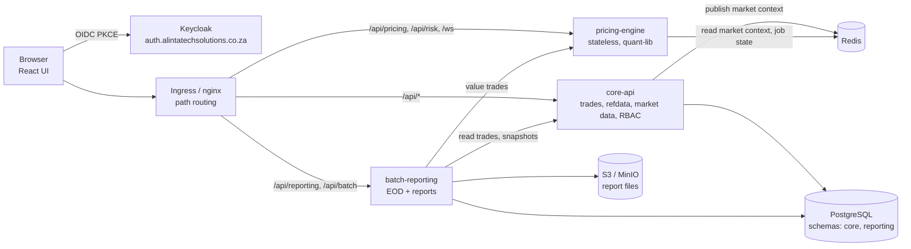
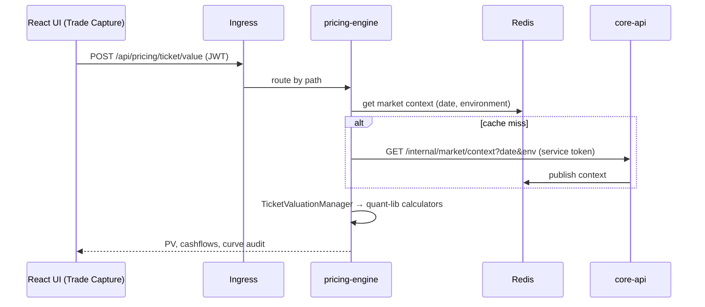
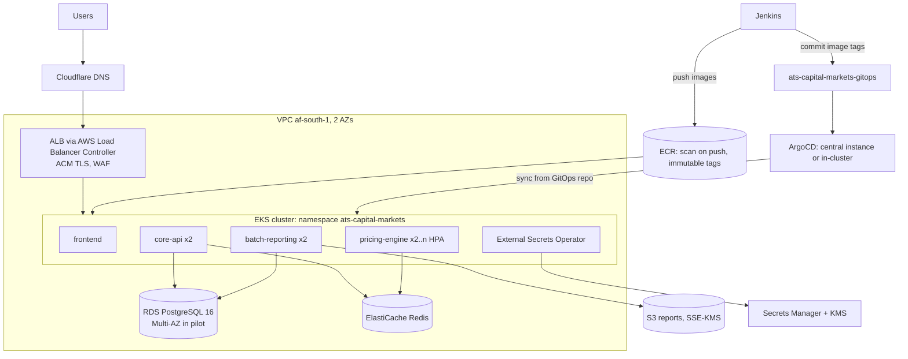
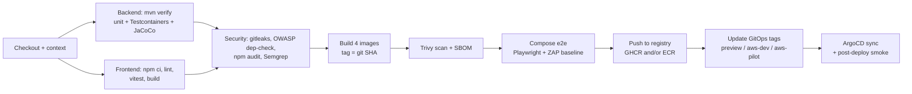
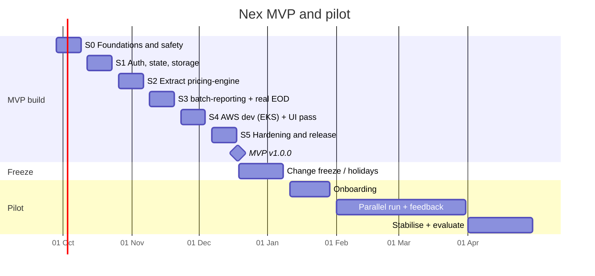

# Nex (ATS Capital Markets) — Technical Architecture & MVP Delivery Plan

| | |
|---|---|
| **Document** | Technical guide: current state, target architecture, environments, CI/CD, MVP sprint plan, pilot plan |
| **Version** | v0.3 (24 Sep 2026). Replaces v0.2, which was based on the wrong repository |
| **Codebase** | [`Alintatech-Solutions/ats-capital-markets-app`](https://github.com/Alintatech-Solutions/ats-capital-markets-app), `main` @ `805753b` |
| **Audience** | Developers, tech lead, DevOps, QA |
| **Inputs** | *ATS Trading Platform — Investor Business Plan V1.0*; the repository above, including `CLAUDE.md`, `docs/AI_CONTEXT.md`, `docs/PLATFORM_STATE.md` and `docs/FRONTEND_UI_APP_SHELL.md`; product direction from the founders (24 Sep 2026) |
| **Status** | Draft for engineering review |

---

## 0. What changed in v0.3

v0.1 and v0.2 were written against `Mutwila-Alinta/ATS`, an early Java prototype. This version is based on the actual application, **`ats-capital-markets-app`**. That app is far more advanced, so the plan changes from *building* the MVP to *hardening, splitting and moving* a working application.

| Topic | v0.2 | **v0.3** |
|---|---|---|
| Starting point | Prototype pricing classes, no services | A working full-stack app: 9 UI modules, 17 priced product types, curve bootstrapping, risk, scenarios, reporting batches, RBAC, K8s/GitOps deployment |
| Build | Gradle | **Maven** (keep, as the repo requires) |
| Microservices | 4 new services built from scratch | **Split the existing monolith** into 3 services along existing package boundaries (strangler pattern) |
| AWS runtime | ECS Fargate | **EKS + ArgoCD**, which keeps the repo's mandated Jenkins → registry → GitOps → ArgoCD flow and reuses the Kustomize manifests |
| CI/CD | New GitHub Actions | **Extend the existing Jenkins pipelines** (`Jenkinsfile`, `Jenkinsfile.aws`) |
| UI | Wire an assumed React app | The **existing React app is kept**; work is limited to performance, code health and look & feel |
| Dates | MVP 18 Dec 2026; pilot Jan–Apr 2027 | **Unchanged** |

---

## 1. Summary for developers

- **MVP (v1.0.0, 18 Dec 2026)** is today's functionality, made secure, durable and scalable. The work:
  - real Keycloak authentication in place of the auth bypass
  - no in-memory state across replicas
  - a real EOD run in place of the simulated one
  - Flyway-owned schema
  - reports stored in S3
  - the back end split into three services: `core-api`, `pricing-engine` and `batch-reporting`

  It runs on Docker Compose and on **AWS dev (EKS, af-south-1)**, deployed by Jenkins → ECR → GitOps → ArgoCD, with automated tests and security gates.
- **The UI stays as it is.** Work covers pinned dependencies, code splitting, breaking up the two very large components, lint and tests, and look-and-feel polish.
- **Pilot:** 11 Jan – 30 Apr 2027, on a dedicated AWS pilot environment.
- **Reality check:** the application logic largely exists, so a 12-week window is achievable. The risk sits in the security, state and EOD fixes and in the AWS platform work. §8.4 lists what to cut if needed.

---

## 2. Current state (verified 24 Sep 2026)

### 2.1 What exists

| Area | What's there |
|---|---|
| **Repository layout** | `backend/` (Spring Boot), `frontend/` (React/Vite), `docker-compose.yml` (postgres, redis, backend, frontend), `apps/ats-capital-markets/` (Kustomize base + `devops-pipeline` overlay), `infrastructure/argocd/`, `Jenkinsfile` (GHCR + GitOps + PR previews), `Jenkinsfile.aws` (build and push to ECR), `.github/workflows/pr-preview-cleanup.yml`, `docs/` |
| **Back end** | Java 21, Spring Boot 3.3.5, Maven; about 25.5k lines. Uses Web, Data JPA, Batch, Redis, Security + OAuth2 resource server, WebSocket (STOMP), Flyway, Apache POI. Also has H2 for local runs |
| **Back-end packages** | `trade`, `refdata`, `market` (curves, snapshots, environments, fixings, OIS curve stripping, bootstrap), `pricing` (products, foundation, tools), `risk`, `scenario`, `simulation`, `reporting` (definitions, batches with DAG edges, executions, schedules, CSV output), `batch`, `security` (users, 20 roles, 60 permissions), `workspace` |
| **Pricing coverage** (`TicketValuationManager` implementations) | OIS swap, term swap, IRS swap, bond, bond forward, credit note (incl. z-spread solver and PD term structures), deposit, FX forward, FX swap, equity future, IRS future, listed option, OTC option, TRS |
| **Market data** | Curves and nodes, snapshots per date and environment, OIS swap curve definitions with stripping conventions, curve bootstrapping, index fixings, fixing-to-curve mappings, CSV import (preview/commit). Distributed cache: Postgres → Redis → an immutable context held in the JVM |
| **Trade lifecycle** | Draft → Pending Approval → Trader Confirmed / Amended / Cancelled; book, amend, cancel, submit-for-approval, approve; portfolio–counterparty gate |
| **Front end** | React (unpinned `latest`), Vite 8, TypeScript, Tailwind 3, zustand, oidc-client-ts (Keycloak PKCE), STOMP risk socket worker, exceljs. About 17k lines. **9 modules:** Trade Capture, Trade Blotter, Market Data, Valuation, Risk, Operations, Reporting, Reference Data, User Management. Dark "terminal" theme and fixed app shell (`docs/FRONTEND_UI_APP_SHELL.md`) |
| **Database** | PostgreSQL 16 with 30 JPA tables. Flyway has `V1__reporting_module`, `V2` (Postgres-only backfill) and `V3__add_ois_curve_stripping_conventions`; **all other tables are created by Hibernate `ddl-auto: update`** |
| **Deployment today** | Jenkins → GHCR → GitOps repo → ArgoCD → Rancher RKE2. Includes per-PR preview namespaces, Vault + External Secrets Operator, Cloudflare Tunnel, Traefik ingress. `Jenkinsfile.aws` builds and pushes images to ECR in `af-south-1`, but has no deploy stage |
| **Tests** | **Back end: 21 suites, 83 tests, all passing** (`mvn test`, run 24 Sep). **Front end: builds** (`tsc -b && vite build`) with **no tests or lint**. Main bundle 810 KB (185 KB gzipped), exceljs chunk 930 KB |

### 2.2 Gaps that block a pilot (verified in code)

| # | Gap | Evidence | Fix (sprint) |
|---|---|---|---|
| G1 | **Authentication is bypassed** | `SecurityConfig.TEMPORARY_AUTH_BYPASS = true` lets anyone call `/api/**`. The OAuth2 resource-server auto-config is excluded in `application.yml`. Dev-login tokens live in an in-memory map (`DevSessionRegistry`) | Turn on Keycloak JWT validation; keep dev login only under the `local` profile (S1) |
| G2 | **In-memory state with 2 replicas** | `backend-deployment.yaml` sets `replicas: 2`. State is held in `ConcurrentHashMap`s in `DevSessionRegistry`, `RiskEngineService.jobs`, `BatchController.progress` and `SpringDynamicSchedulerService`. As a result, sessions and jobs are lost between pods, and **scheduled report batches fire on every replica** | Redis for job/session state; ShedLock for schedules (S1) |
| G3 | **EOD run is simulated** | `BatchController` just loops 0→100% with `Thread.sleep` | Real Spring Batch EOD job (S3) |
| G4 | **Schema not owned by migrations** | `ddl-auto: update` (default) vs `validate` (prod). Flyway covers only reporting and conventions, so there is no reproducible way to create a production database | Flyway baseline migration for the full schema; `validate` everywhere except local H2 (S0) |
| G5 | **Report files on local disk** | `LocalFileStorageService` writes to `./report-output`, which is lost on pod restart and not shared between replicas | S3-backed `FileStorageService` (MinIO locally) (S1) |
| G6 | **No security scanning; weak AWS pipeline** | No SAST, dependency, secret or image scanning in `Jenkinsfile`. `Jenkinsfile.aws` uses static AWS keys (`ats-dev-aws-credentials`) and pushes a mutable `latest` tag | Add scanning stages; IAM role; immutable tags (S0–S4) |
| G7 | **Front-end maintainability** | Unpinned `latest` for react, typescript, zustand and vite plugin. `TradingWorkstation.tsx` has 4,374 lines; `MdcmModule.tsx` has 2,603. No code splitting. Leftover `srcFE16Jul/` folder and zip, `dump_xlsx_tmp.cjs`; sample instruments hard-coded in `App.tsx` | §7 (S0, S4) |
| G8 | **Observability** | No Spring Actuator (custom `HealthController`). `System.out.println` in the pricing path. No metrics or traces | Actuator, Micrometer, JSON logs, OpenTelemetry (S0) |
| G9 | **Code hygiene** | Placeholder formulas in `PricingService.value` (`/api/pricing/value`) next to the real ticket pricers. `.txt` files and sample JSON/CSV in `src/main/java`. A stray `com.alinta...` package. A `Test2` file at the root | Remove or relocate (S0) |

### 2.3 Repository rules this plan respects

`CLAUDE.md` and `docs/AI_CONTEXT.md` require: **Maven** (not Gradle); the Jenkins → image registry → GitOps → ArgoCD deployment flow; no manual `kubectl`/Helm on shared environments; secrets through Vault/External Secrets only; and every platform change recorded in `docs/PLATFORM_STATE.md`. The AWS move below keeps the same flow and swaps only its components: ECR for GHCR, EKS for RKE2, and AWS Secrets Manager behind External Secrets as another secret store.

---

## 3. MVP functional scope — "keep current functionality"

All nine modules and all current products stay. The MVP makes them production-grade.

| Module (UI) | Keeps | MVP hardening |
|---|---|---|
| **Trade Capture** | Tickets for all 17 product types; live valuation, expected and realised cashflows from the ticket | Calls go to `pricing-engine`; valuation audit stored; `System.out` replaced with structured logs |
| **Trade Blotter** | Blotter, amend, cancel, approve, copy | Authorisation checks on every action; append-only **trade version/audit history** (new) |
| **Market Data** | Curves, snapshots, environments, OIS curve stripping, bootstrap, fixings, CSV import | Maker-checker roles enforced (`MARKET_DATA_MAKER/CHECKER` already exist); cache invalidation across services through Redis |
| **Valuation** | Portfolio valuation views | Backed by persisted EOD results as well as ad-hoc runs |
| **Risk** | Risk engine jobs (DV01 etc.) and WebSocket updates | Job state in Redis, so any replica can serve status; runs in `pricing-engine` |
| **Operations** | EOD trigger and progress | **Real EOD run** (§4.7) with progress from Spring Batch metadata |
| **Reporting** | Definitions, batches with dependency edges, schedules, execution history, CSV reports (EOD valuations, expected/realised cashflows, positions, blotter, valuation attribution) | Runs in `batch-reporting`; runs once per schedule (ShedLock); output to S3 |
| **Reference Data** | Counterparties, roles, portfolios and links, holiday calendars, credit ratings/PD points, audit log | Unchanged; the audit log is extended to trades |
| **User Management** | Users and roles (20 roles, 60 permissions) | Users come from **Keycloak**; roles map to the existing RBAC permission codes |

**Out of MVP scope:** new asset classes, new risk measures, SWIFT/FIX, vendor market-data feeds, pooled multi-tenancy, AI/RPA modules.

---

## 4. Target architecture

### 4.1 Principles

1. **Split the monolith along existing package boundaries.** Carve out services where there is a clear operational reason (scaling or isolation). Don't rewrite working pricing code.
2. **The pricing library is plain Java.** `quant-lib` holds the `pricing/*` foundation, tools, market-data maths and per-product calculators, with no Spring or database dependencies. That keeps it testable and reusable by any service.
3. **Stateless services.** All state lives in PostgreSQL, Redis and S3, so any replica can serve any request.
4. **One deployment flow everywhere.** Jenkins builds, tests and scans; pushes images; updates GitOps; ArgoCD deploys. Docker Compose is for local development and CI end-to-end tests only.
5. **Security and audit by default.** Keycloak JWT on every call, and an audit trail for trades, reference data and market data.

### 4.2 Service split (MVP)

| Service | Built from (current packages) | Responsibilities | State | Scales on |
|---|---|---|---|---|
| **`core-api`** | `trade`, `refdata`, `market` (management), `security`, `workspace`, `scenario`, `simulation` | Trade booking and lifecycle, reference data, market-data CRUD/import/bootstrap/snapshots, users and RBAC, workspace layouts, scenario capture | PostgreSQL schema `core`; publishes market contexts to Redis | API traffic |
| **`pricing-engine`** | `pricing/*` (via `quant-lib`), `risk`, `market` read-side (`ImmutableMarketDataContext`, caches) | Ticket valuation, expected and realised cashflows, risk jobs, and valuation for EOD workers | **Stateless.** Market context read from Redis (populated by `core-api`) with a fallback to `core-api`'s internal snapshot API | CPU (HPA) |
| **`batch-reporting`** | `reporting/*`, `batch` | Report definitions, batches, schedules, executions; **EOD job**; files to S3 | PostgreSQL schema `reporting` + Spring Batch metadata; S3 | Scheduled load |
| **`frontend`** | `frontend/` | React SPA via nginx | – | – |

Routing needs no separate API gateway. In Docker, the frontend's nginx splits `/api/*` by path. On Kubernetes, ingress rules do the same:

| Path prefix | Service |
|---|---|
| `/api/pricing/**`, `/api/risk/**`, `/ws/**` (risk socket) | `pricing-engine` |
| `/api/reporting/**`, `/api/batch/**` | `batch-reporting` |
| everything else under `/api/**` | `core-api` |

**After the pilot** (candidates, not MVP): split `market-data-service` and `refdata-service` out of `core-api`, and add an event bus (SNS/SQS or MSK) for trade and market-data events.



### 4.3 Maven multi-module layout

```
backend/
├── pom.xml                      # parent (packaging=pom), dependencyManagement, plugins (Spotless, JaCoCo, dependency-check, CycloneDX)
├── quant-lib/                   # pure Java: pricing/foundation, tools, math, marketData, instruments, per-product calculators
├── platform-common/             # security (JWT → authorities), error model, audit, logging, OpenAPI config, Redis helpers
├── core-api/                    # Spring Boot app (today's CapitalMarketsApplication, minus pricing, risk and reporting)
├── pricing-engine/              # Spring Boot app: PricingController, RiskEngine, market-context readers
└── batch-reporting/             # Spring Boot app: reporting/*, EOD Spring Batch job, S3 storage
```

**Migration approach (behaviour-preserving):**
1. Create the parent POM and move today's code unchanged into `core-api`. The 83 tests must stay green.
2. Move the `pricing` foundation, tools and calculators into `quant-lib`, and the shared security and error code into `platform-common`.
3. Create `pricing-engine` and move `PricingController`, the `TicketValuationManager`s and `RiskEngine*` into it. In `core-api`, replace direct calls with a generated client.
4. Create `batch-reporting` the same way, and delete the moved code from `core-api`.

Each step is its own PR with a preview environment, following the repo's workflow.

### 4.4 Data architecture

| Topic | Target |
|---|---|
| Schema ownership | Schema `core` (trades, OIS legs/schedules, refdata, market curves/snapshots/fixings/indices, credit ratings, users/roles/permissions, workspace) is owned by `core-api`. Schema `reporting` (`report_*`, `batch_edge`, `execution_history`, Spring Batch `BATCH_*`, `eod_valuation`, `eod_cashflow`) is owned by `batch-reporting`. `pricing-engine` has no database |
| Migrations | **Flyway only.** Create `V0__baseline` per schema from the schema Hibernate generates today (review with `pg_dump --schema-only`, then commit). Existing databases use `baseline-on-migrate` at version 0. Set `ddl-auto: validate` in every profile except local H2 |
| Trade audit (new) | Append-only `trade_version` (`trade_id`, `version`, `status`, full payload JSON, `changed_by`, `changed_at`, `reason`), written on book/amend/cancel/approve. The existing `refdata_audit_log` pattern is reused for market data |
| EOD results (new) | `eod_run` (`run_id`, `business_date`, `snapshot_id`, `environment`, `status`, counts), `eod_valuation` (per trade: PV, currency, measures JSON), `eod_cashflow` (per trade and leg). Reports read from these tables instead of re-pricing |
| Redis | Market-context cache (existing `DistributedMarketDataCache`), risk and EOD job state, dev sessions (local only), ShedLock locks (or JDBC ShedLock) |
| Object storage | `FileStorageService` gets an `S3FileStorageService` (AWS SDK v2). MinIO in Compose, S3 on AWS; keys `reports/{date}/{executionId}/...` |

### 4.5 Security

1. **Browser:** unchanged. oidc-client-ts runs Authorization Code + PKCE against Keycloak (`ats-capital-markets` realm, client `capital-markets-web`).
2. **Services:** remove `TEMPORARY_AUTH_BYPASS` and stop excluding `OAuth2ResourceServerAutoConfiguration`. Enable `oauth2ResourceServer().jwt()`. The existing `keycloakRoleConverter` is extended to map Keycloak realm roles to the **20 existing role codes and 60 permission codes**, so the existing `@PreAuthorize` checks keep working.
3. **Dev login:** `DevTokenAuthenticationFilter` and `/api/auth/login` load only under `@Profile("local")`.
4. **Service to service:** `batch-reporting` → `pricing-engine` and `core-api` use a Keycloak client-credentials token with the existing `INTEGRATION_SERVICE_ACCOUNT` role.
5. **Secrets:** Vault + External Secrets on RKE2 (today). On AWS, **AWS Secrets Manager + External Secrets** (`ClusterSecretStore/aws-secrets-manager`) with **IRSA**, so no static keys. Nothing secret in images or git.
6. **Transport:** TLS at the ALB (ACM) or Cloudflare. Services are reachable only inside the cluster.

### 4.6 Key flow: ticket valuation after the split



### 4.7 EOD run (replaces the simulated batch)

Spring Batch job `eodValuationJob(businessDate, environment)` in `batch-reporting`:
1. **Seal:** resolve and freeze the market snapshot for `businessDate` and `environment` (a `core-api` snapshot commit, which already exists).
2. **Read:** page through live trades from `core-api`.
3. **Process:** value in chunks through `pricing-engine`, with bounded concurrency (reuse `BoundedFanOut`).
4. **Write:** `eod_valuation` and `eod_cashflow`.
5. **Finish:** trigger the dependent report batches (existing DAG edges).

Progress is served over the existing SSE endpoint from Spring Batch step metadata, so any replica can answer. Re-runs are idempotent per `(businessDate, environment, snapshotId)`.

---

## 5. Environments and deployment

### 5.1 Step 1 — Docker

**Goal:** `docker compose up` runs the **whole stack** for local integration work and for CI end-to-end tests. Shared environments still deploy only through Jenkins and GitOps, as the repo rules require.

**Compose services:** `postgres`, `redis`, `minio`, `keycloak` (a dev realm export, **local only**), `core-api`, `pricing-engine`, `batch-reporting`, `frontend`.

**Changes to the current set-up:**

| Current | Change | Why |
|---|---|---|
| One `backend/Dockerfile` | One Dockerfile per service (build argument `MODULE`), multi-stage, non-root (already done), `HEALTHCHECK` on `/actuator/health/readiness`, `JAVA_TOOL_OPTIONS=-XX:MaxRAMPercentage=75` | Three images from one Maven reactor |
| Custom `HealthController` | Spring Boot Actuator (liveness/readiness groups, Prometheus endpoint) | K8s probes, metrics |
| `nginx.conf.template` with one `__BACKEND_UPSTREAM__` | Three upstreams (`__CORE_UPSTREAM__`, `__PRICING_UPSTREAM__`, `__REPORTING_UPSTREAM__`) with path routing as in §4.2; WebSocket upgrade headers on `/ws/` | Service split without UI changes |
| Compose `backend`/`frontend` marked "for CI image builds only" | A full-stack Compose file for local integration and CI e2e; `docker compose up -d postgres redis` stays as the documented day-to-day local set-up | Reproducible end-to-end tests |
| `ddl-auto: update` | Flyway baseline + `validate` | Same schema everywhere |
| Local report folder | MinIO bucket | Same code path as S3 |

**Done when:** from a clean clone, `cp .env.example .env && docker compose up -d --wait` gives a working UI on `:3000` with seed data, and the Playwright smoke suite passes.

### 5.2 Step 2 — AWS target (af-south-1)

**Recommendation: Amazon EKS with ArgoCD, not ECS.** The repo already has Kustomize manifests, ArgoCD applications, External Secrets, preview-namespace automation, and a rule that deployment goes through GitOps. EKS keeps all of that. ECS would mean redesigning the deployment flow, which `docs/AI_CONTEXT.md` explicitly rules out.



| Component | AWS service | Notes |
|---|---|---|
| Container registry | **ECR** (`ats-<env>-core-api`, `-pricing-engine`, `-batch-reporting`, `-frontend`) | Extends the existing `ats-dev-backend`/`-frontend` repositories. Scan on push, immutable tags, lifecycle policy |
| Kubernetes | **EKS** (managed node group, 2 AZs; Karpenter optional later) | Register as an ArgoCD destination (`ats-capital-markets-aws-dev`, `-aws-pilot`) |
| Ingress | **AWS Load Balancer Controller** (ALB) with an `alb` ingress class in the `aws-*` overlays. Traefik stays on RKE2 | The same path routing as §4.2, expressed as ALB ingress rules |
| Database | **RDS PostgreSQL 16** (single-AZ dev, Multi-AZ pilot), PITR, KMS | Matches the PLATFORM_STATE target of a dedicated database outside the cluster |
| Cache | **ElastiCache for Redis** (TLS, auth token) | Replaces the in-cluster Redis deployment on AWS |
| Object storage | **S3** (block public access, SSE-KMS, versioning) | Report output |
| Secrets | **Secrets Manager** + External Secrets (`ClusterSecretStore/aws-secrets-manager`), IRSA | Same Kubernetes Secret names and keys as today (`capital-markets-db`, `capital-markets-redis`) |
| Identity | Keep **Keycloak** at `auth.alintatechsolutions.co.za` | No change for the UI |
| DNS/TLS | Cloudflare DNS → ALB (ACM certificate; Cloudflare "Full (strict)") | e.g. `cm-dev.alintatechsolutions.co.za` (already the `APP_URL` in `Jenkinsfile.aws`) |
| Observability | CloudWatch Container Insights + Fluent Bit; Prometheus/Grafana optional | JSON logs with `traceId` |
| Guardrails | CloudTrail, GuardDuty, AWS Config, AWS Backup | Pilot bank due diligence |

**GitOps layout additions** (in this repo or `ats-capital-markets-gitops`, whichever is canonical):

```
apps/ats-capital-markets/
├── base/                              # + core-api, pricing-engine, batch-reporting deployments/services, HPA, PDBs
└── overlays/
    ├── devops-pipeline/               # existing (RKE2)
    ├── aws-dev/                       # ALB ingress, ElastiCache/RDS endpoints, ESO aws store, IRSA annotations
    └── aws-pilot/                     # replicas, Multi-AZ endpoints, stricter resources
infrastructure/argocd/
├── ats-capital-markets-aws-dev.yaml
└── ats-capital-markets-aws-pilot.yaml
```

**Infrastructure as code:** add a new `infrastructure/terraform/` with modules `network`, `eks` (with the ALB controller, ESO and IRSA roles), `rds`, `elasticache`, `s3`, `ecr`, `iam-jenkins` (role assumed by Jenkins, replacing static keys) and `observability`, plus environments `aws-dev` and `aws-pilot`. State goes in S3 with locking. Record every applied change in `docs/PLATFORM_STATE.md`, as the repo requires.

**Transition:** RKE2 production and PR previews keep running unchanged until the AWS pilot environment is signed off. Whether to cut over production or keep both is decided at pilot exit (D4).

---

## 6. CI/CD: containerise, test, scan, deploy (Jenkins)

### 6.1 Pipeline

We extend the existing `Jenkinsfile` stages (Checkout → Determine Build Context → Backend Tests → Frontend Build → Build and Push Images → Update GitOps → PR preview stages) and bring `Jenkinsfile.aws` in line with them.



| Stage | Tooling | Gate |
|---|---|---|
| Backend build and tests | `mvn -B verify` (Surefire + Failsafe, Testcontainers PostgreSQL/Redis, JaCoCo) | All tests pass; coverage does not drop (ratchet) |
| Frontend | `npm ci`, ESLint, `tsc -b`, Vitest, `vite build` | Zero lint errors; tests pass; bundle budget (§7) |
| Secrets | gitleaks | Zero findings |
| Dependencies (SCA) | OWASP dependency-check Maven plugin; `npm audit --omit=dev` | No critical; high findings need a time-boxed waiver |
| SAST | Semgrep (Java/TS rulesets); GitHub CodeQL optional | No new high findings |
| Images | Trivy (`--severity CRITICAL,HIGH --ignore-unfixed --exit-code 1`), ECR scan on push | Blocks on fixable critical/high |
| SBOM | CycloneDX Maven plugin + Syft for images | Archived per build |
| IaC and manifests | Checkov (Terraform + Kustomize output), `kubeconform` | No failed high checks |
| E2E | `docker compose up --wait` + Playwright smoke (login → book OIS → value → blotter → report) | Pass |
| DAST | OWASP ZAP baseline against the Compose stack | No high alerts |
| Push/deploy | Immutable git-SHA tags (**drop `latest`**); GitOps commit; ArgoCD sync | Post-deploy smoke on the preview/AWS URL |

**`Jenkinsfile.aws` changes:**
- Use an IAM role (Jenkins instance profile or `AssumeRole` via `iam-jenkins`) instead of `ats-dev-aws-credentials`.
- Build all four images.
- Add the test and scan stages above.
- Update the `aws-dev` overlay image tags in GitOps. **Do not deploy directly.**

### 6.2 Test strategy

| Level | Scope | Target |
|---|---|---|
| Unit — `quant-lib` | Day counts, calendars, schedules, curves/bootstrap, each product's calculator | Keep all 83 existing tests green. Add **golden tests** against independent reference values (QuantLib or pilot/Bloomberg) for OIS, bond, deposit and FX forward first. Line coverage ≥ 80% in `quant-lib` by pilot |
| Service | Controllers, security (`@PreAuthorize` per role), trade lifecycle, EOD job | `@SpringBootTest` + Testcontainers; every endpoint has an authorisation test |
| Contract | `core-api` ↔ `pricing-engine` ↔ `batch-reporting` | OpenAPI (springdoc) specs committed; generated clients; schema-diff check in CI |
| Front end | Stores, pricing builders (`ticketParameterBuilders.ts`, `utils/pricing.ts`), key components | Vitest + React Testing Library; critical paths covered |
| E2E | The 9 modules' happy paths | Playwright on Compose (PR) and on preview/AWS dev (post-deploy) |
| Performance | EOD 10k trades; ticket valuation p95; blotter 5k rows | EOD < 15 min on AWS dev; valuation p95 < 500 ms; blotter p95 < 1 s |

---

## 7. Front end — efficiency and look & feel

The UI, its modules and its workflows **stay as they are**. Follow `docs/FRONTEND_UI_APP_SHELL.md` (fixed app shell, dark terminal theme, sharp corners).

| Area | Change |
|---|---|
| Reproducible builds | Pin every `latest` dependency (react, react-dom, typescript, zustand, lucide-react, @vitejs/plugin-react) to exact versions; Renovate/Dependabot for upgrades |
| Bundle and load time | `React.lazy` per module tab (9 chunks); load **exceljs only on export** (dynamic `import()`); `manualChunks` for vendor code. Budget: initial JS ≤ 150 KB gzipped (today 185 KB main + 256 KB exceljs) |
| Runtime efficiency | Split `TradingWorkstation.tsx` (4.4k lines) and `MdcmModule.tsx` (2.6k lines) into feature subcomponents and hooks with no visual change; memoise grid rows; narrow zustand selectors to avoid re-renders; virtualise long lists (blotter, curve nodes); debounce live re-valuation calls |
| API layer | Generate TypeScript types from springdoc OpenAPI (`openapi-typescript`) into `src/api/generated`; `api.ts` becomes thin wrappers; one retry and error-toast policy |
| Look & feel | Consolidate colours and spacing into Tailwind theme tokens; consistent loading skeletons, empty states and error toasts across modules; convert any remaining light-palette components to the dark theme; check keyboard focus and contrast (axe in Playwright) |
| Code health | Delete `srcFE16Jul/`, `srcFE16Jul.zip`, `dump_xlsx_tmp.cjs`; move the sample instruments in `App.tsx` to fixtures; add ESLint + Prettier + Vitest; strict TypeScript |
| Delivery | nginx routes to three upstreams (§5.1); gzip/brotli and cache headers for hashed assets |

---

## 8. Delivery plan to MVP (28 Sep – 18 Dec 2026)

### 8.1 Timeline



### 8.2 Sprint backlog

**S0 — Foundations and safety (28 Sep – 9 Oct)**
- Maven parent POM; move current code into `core-api` unchanged; 83 tests green in Jenkins.
- **Flyway `V0__baseline`** from the current Hibernate schema; `ddl-auto: validate` (except local H2); verify on an empty Postgres and on a copy of the dev database.
- Spring Boot Actuator, Micrometer, JSON logging; replace `System.out.println` with SLF4J; springdoc OpenAPI.
- Remove dead code and assets (G9). Mark `/api/pricing/value` deprecated, and remove it if the UI doesn't use it.
- Front end: pin dependencies; ESLint, Prettier and Vitest set-up; delete leftovers.
- Jenkins: add gitleaks, dependency-check, `npm audit`, Trivy and SBOM stages (reporting only this sprint; they block from S2).
- Full-stack `docker-compose.yml` (plus Keycloak dev realm and MinIO) for local and CI use.
- ADRs: 001 service split, 002 EKS + ArgoCD on AWS, 003 Flyway baseline, 004 Redis state, 005 S3 storage.

**S1 — Auth, state and storage (12 – 23 Oct)**
- Keycloak JWT enabled; `TEMPORARY_AUTH_BYPASS` removed; Keycloak realm roles mapped to the 20 RBAC roles and permission codes; dev login limited to `@Profile("local")`.
- Authorisation tests per endpoint and role.
- Redis-backed job state for the risk engine and batch progress; ShedLock on `SpringDynamicSchedulerService`.
- `S3FileStorageService` (MinIO locally).
- `trade_version` audit table, written on every lifecycle action; shown in the blotter's trade history.
- Playwright smoke in CI against Compose.

**S2 — Extract `pricing-engine` (26 Oct – 6 Nov)**
- `quant-lib` module (pricing foundation, tools and calculators); `platform-common`.
- `pricing-engine` app: `PricingController`, the `TicketValuationManager`s, `RiskEngine*`, STOMP risk socket; market context from Redis, with a fallback to the `core-api` internal endpoint.
- nginx and ingress path routing; contract tests; generated Java client.
- Golden-value tests for OIS, bond, deposit and FX forward.
- Performance baseline for ticket valuation.

**S3 — `batch-reporting` and real EOD (9 – 20 Nov)**
- `batch-reporting` app: `reporting/*`, `batch`; schema `reporting`.
- **Spring Batch `eodValuationJob`** (§4.7); `eod_run`/`eod_valuation`/`eod_cashflow`; SSE progress from job metadata; the Operations module wired to it.
- Report queries read from persisted EOD results; the dependency graph runs after EOD.
- Load test: EOD with 10k synthetic trades.

**S4 — AWS dev on EKS and UI pass (23 Nov – 4 Dec)**
- Terraform: network, EKS (ALB controller, ESO, IRSA), RDS, ElastiCache, S3, ECR repos, Jenkins IAM role.
- `aws-dev` Kustomize overlay; ArgoCD application; Secrets Manager entries; `cm-dev` DNS → ALB.
- `Jenkinsfile.aws` extended (tests, scans, 4 images, GitOps update, no static keys).
- UI: module code splitting, lazy-loaded exceljs, decomposition of `TradingWorkstation`/`MdcmModule`, theme-token and skeleton/toast pass.
- `docs/PLATFORM_STATE.md` updated.

**S5 — Hardening and release (7 – 18 Dec)**
- Full Playwright regression on AWS dev; ZAP baseline; all scan gates green.
- RDS restore drill; runbooks (deploy/rollback via GitOps revert, EOD failure, Keycloak user admin, incident response).
- `aws-pilot` environment provisioned (Multi-AZ RDS, 2+ replicas), empty.
- **Tag `v1.0.0` on 18 Dec 2026**, with release notes and a stakeholder demo.

### 8.3 MVP acceptance criteria

| # | Criterion |
|---|---|
| AC1 | All 9 modules and 17 product types work as they do today, now running on `core-api` + `pricing-engine` + `batch-reporting`, on Docker Compose **and** AWS dev |
| AC2 | No anonymous access: every `/api/**` call needs a valid Keycloak JWT, and role checks pass the authorisation test suite |
| AC3 | Killing any single pod loses no session, job, schedule or report file. Scheduled batches run exactly once |
| AC4 | The EOD run values all live trades for a date and environment, persists the results, and runs the dependent reports. 10k trades complete in < 15 min |
| AC5 | A new database is created only by Flyway; `validate` passes in every deployed environment |
| AC6 | The Jenkins pipeline runs tests, SCA, SAST, secret, image and IaC scans and the e2e suite, with no open critical/high findings. Images use immutable tags; deployment goes only through GitOps and ArgoCD |
| AC7 | Pricing results are unchanged by the split (a regression suite compares before and after for all product types). Golden tests pass for OIS, bond, deposit and FX forward |
| AC8 | Front end: dependencies pinned, lint/tests in CI, initial JS ≤ 150 KB gzipped, no visual regressions in the 9 modules |
| AC9 | RDS restore drill done; runbooks and `PLATFORM_STATE.md` up to date |

### 8.4 Scope protection

If a sprint slips, cut in this order. **Never cut** G1–G5 (auth, state, EOD, migrations, storage), tests or security gates.
1. Front-end component decomposition (keep code splitting and pinning).
2. `batch-reporting` stays a module inside `core-api` (the real EOD and ShedLock still ship).
3. AWS dev on EKS moves to the first two weeks of January. The Docker Compose MVP and the RKE2 preview flow still ship on 18 Dec.
4. Keep extra golden tests to the four listed products.

### 8.5 Definition of Done

- PR with review; preview environment checked (repo workflow); all Jenkins gates green.
- Tests at the right level; no pricing regression for the product types touched.
- Flyway migration for every schema change.
- Audit written for every state change.
- OpenAPI updated.
- `PLATFORM_STATE.md` updated for any platform change.

---

## 9. Pilot onboarding and feedback (11 Jan – 30 Apr 2027)

| Phase | Dates | Activities |
|---|---|---|
| **Onboarding** | 11 – 29 Jan | `aws-pilot` go-live; Keycloak users/roles for pilot staff (optional federation to their IdP); load reference data (counterparties, portfolios, calendars, credit ratings) and market data (curves, fixings) through the existing import screens; migrate open trades (CSV → booking API); train traders, middle office, risk and operations |
| **Parallel run** | 1 Feb – 31 Mar | Daily EOD in Nex alongside the client's current process; automated **reconciliation report** (PV, cashflows, positions vs the client's figures) in `batch-reporting`; 2-week pilot sprints releasing through the normal GitOps flow |
| **Stabilise and evaluate** | 1 – 30 Apr | Fixes only; performance tuning on real volumes; user survey and interviews; case study; Beta go/no-go and scope |

**Feedback loop:**
- In-app "Feedback" action (header menu), posted to `core-api` with the module, user and trace ID, and forwarded to the issue tracker (`pilot-feedback`).
- Weekly session with pilot users.
- Triage: **P1** (blocks booking or EOD) gets a hotfix within 1 business day. **P2** goes into the next pilot sprint. **P3** and enhancements go to the Beta backlog.
- **KPIs:** reconciliation pass rate, EOD duration, P1/P2 counts, availability, time to book, monthly satisfaction score.

**Exit criteria:** 20 consecutive business days of reconciliation within tolerance; no open P1 issues and ≤ 3 open P2 issues; ≥ 99.5% availability in business hours; pilot sign-off; production platform decision (D4).

---

## 10. After the pilot (outline)

| Stage | Window | Focus |
|---|---|---|
| **Beta** | May – Sep 2027 | Split `market-data-service` and `refdata-service`; event bus; pre-trade limits; vendor market-data feed; historical VaR/stress in the risk engine; pooled multi-tenancy; SOC 2 Type I readiness; 2–5 clients |
| **GA** | Target Q4 2027 | Tiered packaging and feature flags per module; tenant provisioning; SWIFT confirmations through a partner; SOC 2 Type II; AWS Marketplace listing |
| **Scale** | 2028+ | AI anomaly detection, RPA hooks, further asset classes and regions |

---

## 11. Team

| Role | FTE | Owns |
|---|---|---|
| Tech lead / architect | 1 | Service split, security, ADRs, reviews |
| Back-end (quant) | 1 | `quant-lib`, `pricing-engine`, golden and regression tests |
| Back-end | 1–2 | `core-api`, `batch-reporting`, EOD, Flyway |
| Front-end | 1 | Front-end efficiency, look & feel, Playwright |
| DevOps | 1 | Jenkins, Terraform, EKS/GitOps overlays, `PLATFORM_STATE.md` |
| Product owner / BA (part-time) | 0.5 | Scope, acceptance, pilot relationship and fixtures |

---

## 12. Risks

| Risk | Impact | Mitigation |
|---|---|---|
| Turning on real auth breaks UI flows | High | S1 authorisation test suite; Playwright on previews; roles mapped 1:1 to existing permission codes |
| Pricing regressions from moving code into `quant-lib` / `pricing-engine` | High | Behaviour-preserving moves; before/after regression suite on all 17 product types; golden tests |
| Flyway baseline differs from live databases | Medium | Generate from Hibernate, diff against dev/prod with `pg_dump --schema-only`, dry-run on copies |
| AWS platform work (EKS, IAM, networking) in 2 weeks | Medium | Terraform modules from S0 in parallel by DevOps; the cut rule in §8.4 moves EKS to January without blocking the MVP |
| Two platforms (RKE2 + AWS) to run | Medium | Same manifests (base + overlays); decide the production target at pilot exit (D4) |
| Large front-end components slow down change | Medium | Decompose only with tests in place; no visual changes |

---

## 13. Decisions to confirm in S0

| ID | Decision | Recommendation |
|---|---|---|
| D1 | AWS runtime | **EKS + ArgoCD** (keeps GitOps and the manifests); ECS not recommended for this repo |
| D2 | MVP service split | `core-api` + `pricing-engine` + `batch-reporting`; more splits after the pilot |
| D3 | GitOps home for AWS overlays | The `ats-capital-markets-gitops` repo (like previews), with ArgoCD apps per AWS environment |
| D4 | Production platform after the pilot | Decide at pilot exit: move production to AWS, or run AWS for client tenants and RKE2 internally |
| D5 | ArgoCD for EKS | Register EKS clusters with the existing central ArgoCD (`argocd.alintatechsolutions.co.za`) rather than a new instance |
| D6 | Pilot tenancy | Dedicated `aws-pilot` environment |

---

## Appendix A — Local development

```bash
# day-to-day (unchanged from CLAUDE.md)
docker compose up -d postgres redis
cd backend && SPRING_PROFILES_ACTIVE=local mvn -pl core-api spring-boot:run
cd frontend && npm install && npm run dev          # http://localhost:5173, proxies /api

# full stack (local integration / CI e2e)
cp .env.example .env
docker compose --profile full up -d --build --wait  # http://localhost:3000
cd frontend && npx playwright test
```

## Appendix B — Conventions

- **Branches and PRs:** feature branch → PR → Jenkins PR build → preview `cm-pr<N>` → review → merge. Squash merges.
- **Tags:** SemVer `vX.Y.Z` for releases; images tagged with the 12-character git SHA; no `latest` in any deployed manifest.
- **API:** `/api/...` stays compatible for the UI. New internal service-to-service endpoints go under `/internal/...` and need service tokens. ISO-8601 dates.
- **Logging:** SLF4J JSON with `traceId`, `userId`, `tradeId` where relevant. Never log tokens or personal data.
- **Platform changes:** always recorded in `docs/PLATFORM_STATE.md`.

## Appendix C — Glossary

| Term | Meaning |
|---|---|
| Strangler pattern | Moving functionality out of a monolith step by step while it keeps running |
| EKS / ECR / RDS / ElastiCache | AWS managed Kubernetes / container registry / PostgreSQL / Redis |
| IRSA | IAM Roles for Service Accounts: pods get AWS permissions without static keys |
| ESO | External Secrets Operator: syncs secrets from Vault or AWS Secrets Manager into Kubernetes |
| ShedLock | Library that makes a scheduled task run on one replica only |
| Golden test | A test comparing output with an independent reference value |
