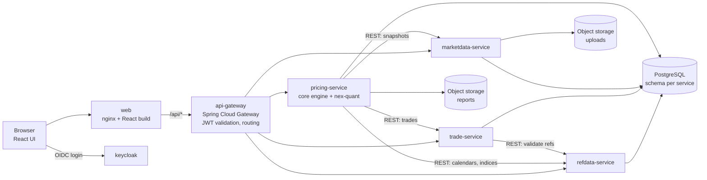
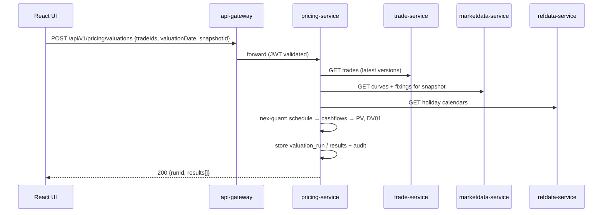
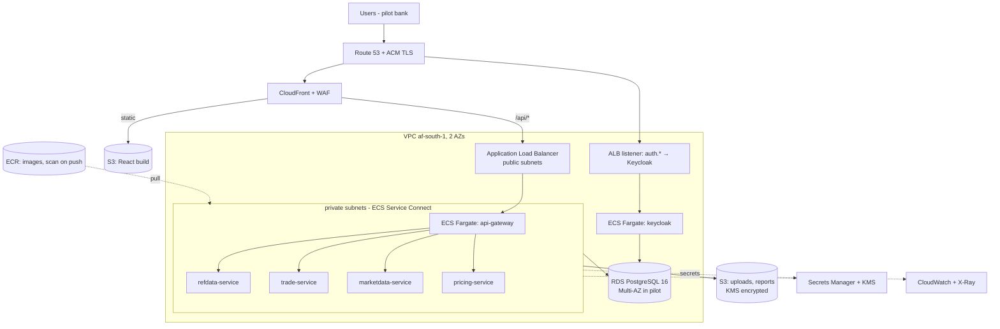
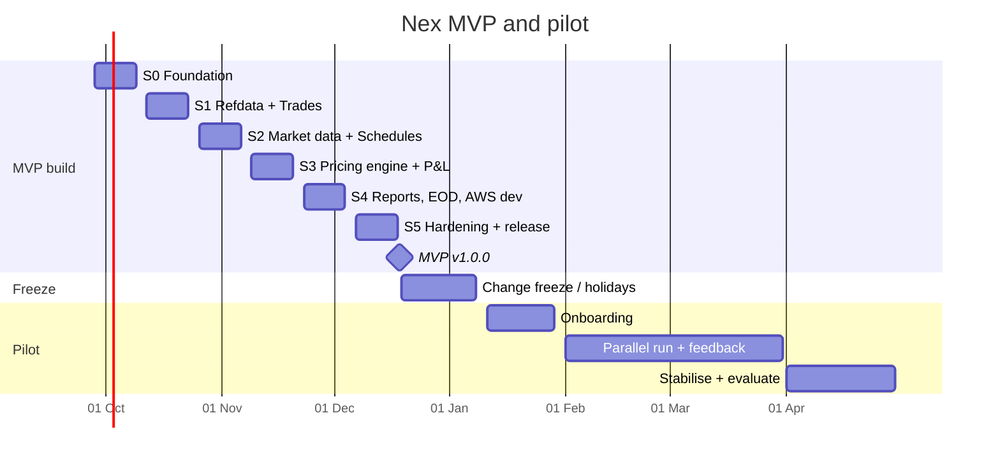

# Nex — Technical Architecture & MVP Delivery Plan

| | |
|---|---|
| **Document** | Nex technical guide: target architecture, environments, CI/CD, MVP sprint plan, pilot plan |
| **Version** | v0.2 (24 Sep 2026). Replaces v0.1 |
| **Audience** | Developers, tech lead, DevOps, QA |
| **Source inputs** | *ATS Trading Platform — Investor Business Plan V1.0*; the `ATS` repository; product direction from the founders (24 Sep 2026) |
| **Status** | Draft for engineering review |

---

## 0. What changed in v0.2

| Topic | v0.1 | **v0.2 (this document)** |
|---|---|---|
| MVP date | April 2027 | **MVP built and released by 18 Dec 2026** |
| Pilot | May–Aug 2027 | **Pilot onboarding and feedback: Jan–Apr 2027** |
| MVP scope | New FX/OIS product scope | **Keep current functionality** and make it work end to end on real services |
| Back-end style | Modular monolith first | **Microservices core engine** (a small, right-sized set of services) |
| Runtime | Managed containers on a cloud to be chosen | **Docker first** (Docker Compose), then **AWS** (ECS Fargate, RDS, S3/CloudFront) |
| UI | New React build replacing JavaFX | **Existing React UI stays largely unchanged**; work is limited to performance and look-and-feel. JavaFX is out of scope |
| Code baseline | Fix compile errors | **Code that doesn't compile is being removed** by the team; we build on what compiles |
| Audience | Founders, investors, engineers | **Technical / developers** |

---

## 1. Summary for developers

- **Goal:** by **18 Dec 2026**, ship Nex **v1.0.0 (MVP)**. It keeps the current functional scope (trade capture for OIS, bonds and loans; market data; valuation, cashflows and P&L; reports), now running as **containerised Java microservices** behind the existing **React** UI. Every change goes through an automated **build → test → security scan → deploy** pipeline.
- **Where it runs:** first **Docker Compose** (developer machines and CI), then **AWS** (`af-south-1`, Cape Town): ECS Fargate, RDS PostgreSQL, ALB, CloudFront/S3, Secrets Manager, all built with Terraform.
- **Services (MVP):** `api-gateway`, `refdata-service`, `trade-service`, `marketdata-service` and `pricing-service` (the core valuation engine, using the `nex-quant` library), plus `web` (React), `keycloak` (identity) and `postgres`.
- **Data:** a single PostgreSQL cluster with **one schema and one DB user per service**, and Flyway migrations owned by each service.
- **Timeline:** six 2-week sprints (S0–S5), **28 Sep → 18 Dec 2026**. Change freeze over the holidays. **Pilot from 11 Jan to 30 Apr 2027.**
- **Reality check:** 12 weeks is tight. The date holds only if (a) the scope stays at *current functionality*, (b) the team has about 4–6 engineers from Sprint 0, and (c) stretch items are cut before hardening work (§8.4).

---

## 2. Baseline and assumptions

### 2.1 Baseline after the cleanup

| Asset | State going into Sprint 0 |
|---|---|
| **Java quant foundations** (`com.ats.pricing.tools`, `com.ats.math.numeric`, most of `com.ats.pricing.foundation`, enums) | Compiling code is kept: day counts (Act/360, Act/365, Act/Act ISDA, 30/360 US), Modified Following, date intervals, `BusinessCenter`, `Currency`, `Payment`, linear interpolation, tenor parsing. **No tests yet** |
| **Prototype OIS valuation** (`ats.FixedLeg`, `FloatingLeg`, `HistoricalFloatingLeg`, curves, loaders) | Logic is kept as a reference and re-implemented in `nex-quant` and `pricing-service` with tests |
| **Code that doesn't compile** (`OvernightIndexSwap`, `InterestRateCurve`, parts of `CashFlow`/`ReferenceTimePeriod`, JavaFX UI) | **Removed by the team.** Where the MVP needs the capability, it is rebuilt in Sprints 1–3 (see §4.8) |
| **React UI** | Exists and stays. Screens: Trade Capture (OIS/Bond/Loan tickets), Market Data, Reports, and the valuation/cashflow/P&L actions. It is wired to the new APIs in the sprints |
| **Reference/sample data** (`counterparties.json`, `trading_books.json`, holidays, SOFR fixings) | Becomes Flyway seed data after fixing formats (ISO dates, unquoted CSV) |
| **Build, services, database, CI, containers** | Not present; created in Sprint 0 |

### 2.2 Assumptions

1. The team is about 4–6 engineers (see §11). One engineer is comfortable with rates maths, and one covers DevOps at least part-time.
2. The React app will be moved into this repository under `nex-web/` in Sprint 0, if it currently lives elsewhere.
3. An AWS account (or AWS Organization) with **af-south-1 enabled** is available by Sprint 3. af-south-1 is an opt-in region.
4. The pilot client supplies sample trades, market data and their current P&L/cashflow output by mid-November 2026, for use as acceptance fixtures.

---

## 3. MVP functional scope — "keep current functionality"

The MVP makes the existing screens and actions real: persisted, validated, priced, audited and exportable.

| # | Feature (current UI) | Today | MVP deliverable | Owner service |
|---|---|---|---|---|
| F1 | **Login / user identity** | Hard-coded user | OIDC login (Keycloak), roles: `TRADER`, `MIDDLE_OFFICE`, `RISK`, `ADMIN`, `AUDITOR` | keycloak, api-gateway |
| F2 | **Trade Capture — header** (trade ID, status, source system, capture date, trader, portfolio/book, counterparty, units, buy/sell, currency, funding status, CSA type, risk definition) | Form only | Validated, persisted **trade header**; server-generated trade ID; dropdowns fed from reference data | trade-service, refdata-service |
| F3 | **OIS ticket** (start/maturity, tenor, payment frequency, payment/fixing lag, floating index, spread, day counts, business centre, roll direction, stub, notional, fixed rate) | Form only | Persisted OIS economics with validation (calendar-adjusted dates, tenor → maturity) | trade-service |
| F4 | **Bond ticket** (effective/maturity, ISIN, coupon, face value) | Form only | Persisted fixed-rate bond economics | trade-service |
| F5 | **Loan ticket** (effective/maturity, loan type, rate, drawdown schedule) | Form only | Persisted fixed-rate loan/deposit with a simple drawdown schedule | trade-service |
| F6 | **Preview / Save / Amend / Cancel** | Preview dialog; Save is a no-op | Save as a version; amend creates version + 1; cancel with reason; full history | trade-service |
| F7 | **Trade blotter** | – | List/filter/sort trades by book, counterparty, product, status, date | trade-service |
| F8 | **Market Data** tab | Placeholder | Upload and view discount curves (DFs or zero rates), fixings (SOFR, ZARONIA), FX rates and holiday calendars, stored as **snapshots per business date** | marketdata-service |
| F9 | **Trade Valuation** | No-op button | PV per trade (OIS, bond, loan) for a chosen valuation date and snapshot | pricing-service |
| F10 | **Future Cashflows** | Placeholder | Projected cashflow schedule per leg (dates, accrual, rate, amount, DF, PV) | pricing-service |
| F11 | **Realized Cashflows** | Placeholder | Settled cashflows up to the valuation date, using historical fixings | pricing-service |
| F12 | **Trade P&L** | Placeholder | Daily P&L = ΔPV + realised cashflows; per trade and per book | pricing-service |
| F13 | **Reports** tab (Summary, Export) | Placeholder | Blotter, positions/PV by book, cashflow ladder and P&L reports; export to **CSV/XLSX** (PDF is a stretch) | pricing-service |
| F14 | **Audit trail** | – | Every create/amend/cancel/upload/valuation-run is recorded with user, time, before and after values | all services (shared lib) |
| F15 | **EOD run** | – | A button or schedule that revalues all live trades for a business date and stores the results | pricing-service |

**Out of MVP scope** (Beta and later): new asset classes (FX, equities, IRS vs JIBAR, options), VaR/Greeks beyond DV01, limits, SWIFT/FIX, live vendor feeds, pooled multi-tenancy, event streaming, AI/RPA.

---

## 4. Target architecture

### 4.1 Principles

1. **Right-sized microservices.** Four domain services, split along business boundaries. Each service has its own schema, and services never read each other's tables.
2. **Pricing maths lives in a library.** `nex-quant` is plain Java with no Spring, HTTP or database dependencies. `pricing-service` is a thin shell around it.
3. **Contract-first APIs.** Every service publishes an OpenAPI 3.1 spec. The React UI's TypeScript client is generated from these specs.
4. **Stateless containers.** All state lives in PostgreSQL and S3, and configuration comes from environment variables and secrets. The same image runs in Compose and on ECS.
5. **Immutable trade versions and an audit log.** Rows are never updated in place for business data.
6. **Tenant-ready.** `tenant_id` is on every table from day one, even though the pilot runs on a dedicated environment.
7. **Security and observability in the skeleton.** OIDC, TLS at the edge, structured JSON logs, health endpoints and metrics come in Sprint 0, not later.

### 4.2 Service landscape



| Service | Responsibility | Owns (schema) | Depends on |
|---|---|---|---|
| **web** | Serves the React build (nginx in Docker; S3 + CloudFront on AWS) | – | api-gateway, keycloak |
| **api-gateway** | Single entry point `/api/**`; validates JWTs; routes to services; CORS; rate limiting; request IDs | – | keycloak (JWKS) |
| **keycloak** | Users, roles, OIDC tokens for the UI (Authorization Code + PKCE) | `keycloak` | postgres |
| **refdata-service** | Counterparties, trading books/portfolios, currencies, business centres, holiday calendars, rate indices, enum lists for UI dropdowns | `refdata` | – |
| **trade-service** | Trade header and economics (OIS, Bond, Loan), versioning, lifecycle, blotter queries, trade audit | `trade` | refdata-service |
| **marketdata-service** | Upload, validation and storage of curves, fixings and FX; snapshots per business date | `marketdata` | S3 |
| **pricing-service** | **Core engine:** schedule and cashflow generation, valuation, realised/projected cashflows, P&L, EOD batch, report generation | `pricing` | trade, marketdata, refdata, S3 |

**Service-to-service calls.** These use synchronous REST for the MVP, with generated clients, timeouts, retries and circuit breakers via Resilience4j. Internal calls carry a **service JWT**: the client-credentials grant from Keycloak. Event streaming (SNS/SQS or MSK) is deferred to Beta.

### 4.3 Repository layout (monorepo)

```
ATS/
├── settings.gradle.kts            # includes all JVM modules
├── build-logic/                   # Gradle convention plugins (java, spring-service, quality)
├── libs/
│   ├── nex-quant/                 # pure Java: conventions, calendars, schedules, curves, pricers
│   ├── nex-common/                # shared: error model, audit (AOP), tenant context, security config
│   └── nex-api/                   # OpenAPI specs (*.yaml) + generated Java clients
├── services/
│   ├── api-gateway/
│   ├── refdata-service/
│   ├── trade-service/
│   ├── marketdata-service/
│   └── pricing-service/
├── nex-web/                       # React app (Vite + TypeScript)
├── deploy/
│   ├── docker/                    # docker-compose.yml, .env.example, keycloak realm export, seed data
│   └── terraform/                 # AWS: modules/ + envs/{dev,pilot}
├── .github/workflows/             # ci.yml, deploy-dev.yml, release.yml
└── docs/                          # this document, ADRs (docs/adr), runbooks, API docs
```

Package root: `com.ats.nex.<service>`. Keep the existing `com.ats.pricing.*` and `com.ats.math.*` packages inside `nex-quant` for the MVP, and rename after the pilot.

### 4.4 Technology stack

| Layer | Choice | Notes |
|---|---|---|
| Language / runtime | **Java 21 (LTS)**, Eclipse Temurin base images | Existing code is Java 21 |
| Service framework | **Spring Boot 3.x** (Web, Validation, Data JPA or JDBC, Actuator, Security OAuth2 Resource Server) | Most common stack; fast to hire for |
| Gateway | **Spring Cloud Gateway** | Same stack as the services. On AWS it sits behind the ALB |
| Build | **Gradle (Kotlin DSL)**, version catalog `gradle/libs.versions.toml`, dependency locking | Reproducible builds |
| API contracts | **OpenAPI 3.1**, `openapi-generator` (Java clients), `openapi-typescript` / `orval` (React client) | Contract-first |
| Resilience | **Resilience4j** | Timeouts, retries, circuit breakers |
| Database | **PostgreSQL 16**; **Flyway** per service | RDS PostgreSQL on AWS |
| Identity | **Keycloak 25+** (OIDC, MFA, SAML federation for banks) | The same product runs in Docker and on AWS. Amazon Cognito is the managed alternative |
| Documents | **Apache POI** (XLSX), OpenPDF (PDF, stretch) | POI is already a project dependency |
| Front-end | Existing **React + TypeScript** app | Improvements are listed in §7 |
| Containers | **Docker**, images built with multi-stage Dockerfiles (or Jib) | Non-root user, read-only filesystem where possible |
| Local runtime | **Docker Compose v2** | One command: `docker compose up` |
| Cloud | **AWS af-south-1**: ECS Fargate, ECR, RDS, ALB, CloudFront, S3, Secrets Manager, KMS, CloudWatch, WAF | See §5.2 |
| IaC | **Terraform ≥ 1.7** (S3 remote state with locking) | Modules per component |
| CI/CD | **GitHub Actions**, AWS access through GitHub OIDC (no long-lived keys) | See §6 |
| Observability | Spring Actuator + Micrometer → **CloudWatch** (metrics/logs); OpenTelemetry traces → **AWS X-Ray** | JSON logs with `traceId` and `tenantId` |
| Testing | JUnit 5, AssertJ, **Testcontainers**, WireMock, Vitest, **Playwright**, QuantLib (golden values) | See §6.3 |

### 4.5 API surface (MVP)

All routes go through the gateway under `/api/v1`. Every response uses the shared error model `{code, message, details[], traceId}`.

| Service | Endpoint | Purpose |
|---|---|---|
| refdata | `GET /refdata/counterparties`, `GET /refdata/books`, `GET /refdata/currencies`, `GET /refdata/indices`, `GET /refdata/calendars/{code}/holidays?from&to` | Dropdowns, calendars |
| refdata | `POST/PUT /refdata/{entity}` (ADMIN), `POST /refdata/{entity}:import` (CSV) | Maintenance |
| trade | `POST /trades` | Create a trade (header + `economics` by `productType` ∈ `OIS`, `BOND`, `LOAN`) |
| trade | `GET /trades?book&counterparty&productType&status&from&to&page&size&sort` | Blotter |
| trade | `GET /trades/{tradeId}`, `GET /trades/{tradeId}/versions` | Detail and history |
| trade | `PUT /trades/{tradeId}` (with `If-Match: <version>`) | Amend; creates a new version |
| trade | `POST /trades/{tradeId}:cancel` `{reason}` | Cancel |
| trade | `POST /trades:preview` | Validate and derive dates without saving (Preview button) |
| marketdata | `POST /marketdata/uploads` (multipart CSV/XLSX, `type` ∈ `DISCOUNT_CURVE`, `FIXINGS`, `FX`, `HOLIDAYS`) | Upload and validation report |
| marketdata | `GET /marketdata/snapshots?businessDate`, `POST /marketdata/snapshots/{id}:seal` | Snapshots |
| marketdata | `GET /marketdata/curves/{curveId}?snapshotId`, `GET /marketdata/fixings/{index}?from&to` | Consumed by pricing |
| pricing | `POST /pricing/valuations` `{tradeIds[], valuationDate, snapshotId}` | PV (Trade Valuation button) |
| pricing | `GET /pricing/trades/{tradeId}/cashflows?valuationDate&type=FUTURE\|REALIZED` | Cashflow buttons |
| pricing | `GET /pricing/pnl?book&date` and `GET /pricing/trades/{tradeId}/pnl?date` | P&L |
| pricing | `POST /pricing/eod-runs` `{businessDate}`, `GET /pricing/eod-runs/{runId}` | EOD batch and status |
| pricing | `GET /pricing/reports/{reportType}?format=csv\|xlsx&...` | Reports / export |

### 4.6 Security flow

1. **Browser:** the React app uses OIDC **Authorization Code + PKCE** against Keycloak (realm `nex`, client `nex-web`) and gets a short-lived access token (5 min) plus a refresh token.
2. **Gateway:** validates the JWT signature using Keycloak's JWKS, checks `aud`/`iss`, and forwards `Authorization`, `X-Request-Id` and `X-Tenant-Id` (derived from a token claim).
3. **Services:** each is an OAuth2 resource server with method-level role checks (`@PreAuthorize("hasRole('TRADER')")`). Services are never exposed publicly; on AWS they live in private subnets.
4. **Service to service:** client-credentials tokens (`pricing-service` → `trade-service`) scoped to read-only roles.
5. **Secrets:** `.env` files (git-ignored) in Docker; **AWS Secrets Manager** on ECS, injected as task secrets. Nothing secret lives in images or the repo.

### 4.7 Database modelling

**Rules:**
- One PostgreSQL database `nex`, with schemas `refdata`, `trade`, `marketdata`, `pricing` and `keycloak`. Each service has its own DB user with rights only on its own schema.
- Flyway migrations live in `services/<svc>/src/main/resources/db/migration`, named `V<yyyymmddHHMM>__description.sql`.
- Every table has `tenant_id`, `created_at` and `created_by`. Business tables are append-only or versioned.
- Money and rates use `NUMERIC(24,8)` for amounts and `NUMERIC(18,12)` for rates and DFs. Never use floating-point columns for stored values.

**refdata:**

```sql
CREATE TABLE refdata.counterparty (
  tenant_id       varchar(32)  NOT NULL,
  counterparty_id varchar(32)  NOT NULL,
  code            varchar(32)  NOT NULL,
  name            varchar(200) NOT NULL,
  country         varchar(64),
  rating          varchar(8),
  sector          varchar(64),
  is_bank         boolean      NOT NULL DEFAULT false,
  enabled         boolean      NOT NULL DEFAULT true,
  created_at      timestamptz  NOT NULL DEFAULT now(),
  created_by      varchar(64)  NOT NULL,
  PRIMARY KEY (tenant_id, counterparty_id),
  UNIQUE (tenant_id, code)
);
CREATE TABLE refdata.trading_book (
  tenant_id varchar(32), book_id varchar(32), code varchar(32), name varchar(200),
  restricted boolean NOT NULL DEFAULT false, enabled boolean NOT NULL DEFAULT true,
  created_at timestamptz NOT NULL DEFAULT now(), created_by varchar(64) NOT NULL,
  PRIMARY KEY (tenant_id, book_id)
);
CREATE TABLE refdata.business_centre (code varchar(8) PRIMARY KEY, name varchar(64), time_zone varchar(64), currency char(3));
CREATE TABLE refdata.holiday (centre_code varchar(8) REFERENCES refdata.business_centre, holiday_date date,
  PRIMARY KEY (centre_code, holiday_date));
CREATE TABLE refdata.rate_index (index_code varchar(16) PRIMARY KEY, currency char(3), tenor varchar(8),
  day_count varchar(16), centre_code varchar(8), publication_lag int);
```

**trade** (header columns are typed; product economics are JSONB, validated by the service against a JSON Schema per product):

```sql
CREATE TABLE trade.trade (
  tenant_id        varchar(32)  NOT NULL,
  trade_id         varchar(32)  NOT NULL,        -- server generated, e.g. NEX-000123
  version          int          NOT NULL,
  is_latest        boolean      NOT NULL,
  status           varchar(16)  NOT NULL,        -- NEW, AMENDED, CANCELLED, MATURED
  product_type     varchar(16)  NOT NULL,        -- OIS, BOND, LOAN
  trade_date       date         NOT NULL,
  capture_date     date         NOT NULL,
  trader           varchar(64)  NOT NULL,
  book_id          varchar(32)  NOT NULL,
  counterparty_id  varchar(32)  NOT NULL,
  buy_sell         varchar(4)   NOT NULL,
  currency         char(3)      NOT NULL,
  units            numeric(24,8) NOT NULL DEFAULT 1,
  source_system    varchar(32),
  funding_status   varchar(16),
  csa_type         varchar(32),
  risk_definition  varchar(16),
  notes            text,
  economics        jsonb        NOT NULL,
  change_reason    text,
  created_at       timestamptz  NOT NULL DEFAULT now(),
  created_by       varchar(64)  NOT NULL,
  PRIMARY KEY (tenant_id, trade_id, version)
);
CREATE UNIQUE INDEX ux_trade_latest ON trade.trade (tenant_id, trade_id) WHERE is_latest;
CREATE INDEX ix_trade_blotter ON trade.trade (tenant_id, book_id, status, trade_date) WHERE is_latest;
```

Example `economics` for an OIS:

```json
{ "startDate": "2026-10-01", "maturityDate": "2031-10-01", "tenor": "5Y", "notional": 10000000,
  "fixedRate": 0.0756, "fixedDayCount": "ACT_365F", "floatIndex": "ZARONIA", "spread": 0.002,
  "floatDayCount": "ACT_365F", "paymentFrequency": "6M", "paymentLag": "2D", "fixingLag": "0D",
  "businessCentres": ["ZAJO"], "businessDayConvention": "MODIFIED_FOLLOWING",
  "rollDirection": "BACKWARD", "stubType": "SHORT", "payReceiveFixed": "PAY" }
```

**marketdata:**

```sql
CREATE TABLE marketdata.snapshot (tenant_id varchar(32), snapshot_id uuid, business_date date NOT NULL,
  status varchar(8) NOT NULL,  -- OPEN, SEALED
  created_at timestamptz NOT NULL DEFAULT now(), created_by varchar(64) NOT NULL,
  PRIMARY KEY (tenant_id, snapshot_id));
CREATE TABLE marketdata.curve_point (tenant_id varchar(32), snapshot_id uuid, curve_id varchar(32),
  pillar_date date, value numeric(18,12) NOT NULL, value_type varchar(8) NOT NULL, -- DF, ZERO
  PRIMARY KEY (tenant_id, snapshot_id, curve_id, pillar_date));
CREATE TABLE marketdata.fixing (tenant_id varchar(32), index_code varchar(16), fixing_date date,
  rate numeric(18,12) NOT NULL, source varchar(32), PRIMARY KEY (tenant_id, index_code, fixing_date));
CREATE TABLE marketdata.fx_rate (tenant_id varchar(32), snapshot_id uuid, ccy_pair char(6),
  rate numeric(18,10) NOT NULL, PRIMARY KEY (tenant_id, snapshot_id, ccy_pair));
CREATE TABLE marketdata.upload (tenant_id varchar(32), upload_id uuid PRIMARY KEY, type varchar(16),
  s3_key text, status varchar(16), errors jsonb, created_at timestamptz DEFAULT now(), created_by varchar(64));
```

**pricing:**

```sql
CREATE TABLE pricing.valuation_run (tenant_id varchar(32), run_id uuid PRIMARY KEY, run_type varchar(8), -- ADHOC, EOD
  business_date date, snapshot_id uuid, status varchar(12), started_at timestamptz, finished_at timestamptz,
  trades_total int, trades_failed int, created_by varchar(64));
CREATE TABLE pricing.valuation_result (run_id uuid REFERENCES pricing.valuation_run, trade_id varchar(32),
  trade_version int, pv numeric(24,8), pv_ccy char(3), dv01 numeric(24,8), error text,
  PRIMARY KEY (run_id, trade_id));
CREATE TABLE pricing.cashflow_result (run_id uuid, trade_id varchar(32), leg varchar(8), seq int,
  accrual_start date, accrual_end date, payment_date date, rate numeric(18,12), amount numeric(24,8),
  df numeric(18,12), pv numeric(24,8), realized boolean, PRIMARY KEY (run_id, trade_id, leg, seq));
CREATE TABLE pricing.pnl_daily (tenant_id varchar(32), business_date date, trade_id varchar(32), book_id varchar(32),
  pv_today numeric(24,8), pv_prev numeric(24,8), realized_cf numeric(24,8), pnl numeric(24,8), run_id uuid,
  PRIMARY KEY (tenant_id, business_date, trade_id));
```

**Audit** (in every schema, written by the `nex-common` audit aspect):

```sql
CREATE TABLE <schema>.audit_log (id bigserial PRIMARY KEY, tenant_id varchar(32), ts timestamptz DEFAULT now(),
  actor varchar(64), action varchar(32), entity varchar(32), entity_id varchar(64),
  before jsonb, after jsonb, request_id varchar(64), prev_hash char(64), hash char(64));
```

### 4.8 Core engine: `nex-quant` and `pricing-service`

```
libs/nex-quant
├── conventions/   DayCount (ACT_360, ACT_365F, ACT_ACT_ISDA, THIRTY_360_US), BusinessDayConvention, RollConvention
├── calendar/      HolidayCalendar (from refdata), JointCalendar, BusinessCenter
├── schedule/      ScheduleGenerator (start, end, frequency, stub, roll direction, lags) -> List<Period>
├── curve/         DiscountCurve (interface), InterpolatedDiscountCurve (log-linear DF), FixingSeries
├── product/       OisTrade, FixedRateBond, FixedRateLoan (immutable records built from trade economics)
├── pricer/        Pricer<T>, OisPricer, BondPricer, LoanPricer -> ValuationResult{pv, cashflows[], dv01}
└── pnl/           PnlCalculator (ΔPV + realised cashflows)
```

- **Kept from today's code:** day counts, Modified Following, interpolation, `BusinessCenter`, `Currency`, `Payment`, and tenor parsing. Each gets **golden tests** before it is reused.
- **Rebuilt (these were removed because they didn't compile):**
  - *OIS product and pricer:* the fixed leg plus a compounded-in-arrears floating leg. Realised periods use historical fixings; future periods use forward rates implied by the curve. This follows the prototype `FixedLeg` / `HistoricalFloatingLeg` logic, now with schedules, lags and calendars.
  - *Discount curve:* built from uploaded DFs or zero rates, with log-linear interpolation on DFs.
- **New:** `BondPricer` and `LoanPricer` discount fixed cashflows and principal (clean/dirty price and accrued interest for bonds). `dv01` comes from a +1 bp parallel bump-and-reprice.
- **`pricing-service`** fetches the trade versions, snapshot curves, fixings and calendars; maps them to `nex-quant` objects; prices them in parallel (virtual threads); and stores the results. The EOD run is idempotent per `(business_date, snapshot_id)`.
- **Accuracy gate:** PVs match QuantLib reference values within **0.01% of notional** (target 0.5 bp) for every product in the test suite.

### 4.9 Key flow: Trade Valuation button



---

## 5. Environments and deployment

### 5.1 Step 1 — Docker (developer machines and CI)

**Goal:** `docker compose up` starts the whole platform, seeded with sample data, on any developer laptop and inside CI.

**Recommended changes to the current set-up:**

| Current | Change | Why |
|---|---|---|
| IntelliJ `.iml` with libraries at absolute Windows paths | Gradle wrapper + version catalog; remove `.iml`/`.idea` from git | Reproducible builds in Docker and CI |
| Resources loaded by relative file path | Classpath resources and seed data via Flyway | Works inside containers |
| No config separation | Spring profiles `local`, `docker`, `aws`; everything comes from env vars | Same image everywhere |
| No health checks | Actuator `/actuator/health/{liveness,readiness}` | Compose `healthcheck`, ECS/ALB health checks |
| Plain text logs | JSON logs (Logback + logstash encoder) with `traceId` | CloudWatch Insights queries |

**Service Dockerfile (template, `services/<svc>/Dockerfile`):**

```dockerfile
# build stage
FROM eclipse-temurin:21-jdk AS build
WORKDIR /src
COPY . .
ARG SERVICE
RUN ./gradlew :services:${SERVICE}:bootJar --no-daemon -x test

# runtime stage
FROM eclipse-temurin:21-jre-alpine
RUN addgroup -S nex && adduser -S nex -G nex
WORKDIR /app
ARG SERVICE
COPY --from=build /src/services/${SERVICE}/build/libs/*.jar app.jar
USER nex
EXPOSE 8080
ENV JAVA_TOOL_OPTIONS="-XX:MaxRAMPercentage=75 -XX:+UseZGC"
HEALTHCHECK --interval=15s --timeout=3s --retries=5 CMD wget -qO- http://localhost:8080/actuator/health/readiness || exit 1
ENTRYPOINT ["java","-jar","/app/app.jar"]
```

**`deploy/docker/docker-compose.yml` (outline):**

```yaml
name: nex
services:
  postgres:
    image: postgres:16-alpine
    environment: { POSTGRES_DB: nex, POSTGRES_USER: nex_admin, POSTGRES_PASSWORD: ${PG_ADMIN_PASSWORD} }
    volumes: [ "pgdata:/var/lib/postgresql/data", "./init-db:/docker-entrypoint-initdb.d:ro" ]  # creates schemas + users
    healthcheck: { test: ["CMD-SHELL","pg_isready -U nex_admin"], interval: 5s, retries: 10 }
  keycloak:
    image: quay.io/keycloak/keycloak:25.0
    command: ["start-dev","--import-realm"]
    environment: { KC_DB: postgres, KC_DB_URL: jdbc:postgresql://postgres/nex, KC_DB_SCHEMA: keycloak,
                   KC_DB_USERNAME: keycloak, KC_DB_PASSWORD: ${KC_DB_PASSWORD},
                   KEYCLOAK_ADMIN: admin, KEYCLOAK_ADMIN_PASSWORD: ${KC_ADMIN_PASSWORD} }
    volumes: [ "./keycloak/nex-realm.json:/opt/keycloak/data/import/nex-realm.json:ro" ]
    depends_on: { postgres: { condition: service_healthy } }
    ports: [ "8081:8080" ]
  refdata-service:     { image: nex/refdata-service:${TAG:-local},    env_file: .env, depends_on: { postgres: { condition: service_healthy } } }
  trade-service:       { image: nex/trade-service:${TAG:-local},      env_file: .env, depends_on: [ refdata-service ] }
  marketdata-service:  { image: nex/marketdata-service:${TAG:-local}, env_file: .env, depends_on: [ minio ] }
  pricing-service:     { image: nex/pricing-service:${TAG:-local},    env_file: .env, depends_on: [ trade-service, marketdata-service ] }
  api-gateway:
    image: nex/api-gateway:${TAG:-local}
    env_file: .env
    ports: [ "8080:8080" ]
    depends_on: [ refdata-service, trade-service, marketdata-service, pricing-service, keycloak ]
  web:
    image: nex/web:${TAG:-local}          # nginx serving the Vite build; proxies /api -> api-gateway
    ports: [ "3000:80" ]
    depends_on: [ api-gateway ]
  minio:                                  # S3-compatible storage locally
    image: minio/minio
    command: server /data --console-address ":9001"
    environment: { MINIO_ROOT_USER: ${MINIO_USER}, MINIO_ROOT_PASSWORD: ${MINIO_PASSWORD} }
volumes: { pgdata: {} }
```

The "Docker done" criteria are: a fresh clone, then `cp .env.example .env`, then `docker compose up -d` gives a working UI at `http://localhost:3000` with seed data, and the Playwright smoke suite passes against it.

### 5.2 Step 2 — AWS target architecture



**Docker Compose → AWS mapping:**

| Compose | AWS |
|---|---|
| `web` (nginx) | S3 bucket + CloudFront (same Vite build artefact) |
| `api-gateway`, `*-service` | ECS Fargate services (one task definition per service), images in ECR, discovery via ECS Service Connect |
| `keycloak` | ECS Fargate service (production mode, 2 tasks), schema on RDS |
| `postgres` | Amazon RDS for PostgreSQL 16 (single-AZ dev, Multi-AZ pilot), automated backups + PITR |
| `minio` | Amazon S3 (SSE-KMS, versioning, block public access) |
| `.env` | SSM Parameter Store (config) + Secrets Manager (secrets) |
| container logs | CloudWatch Logs (awslogs driver), Container Insights |

**Why ECS Fargate rather than EKS:** there are no clusters to patch, and it maps one-to-one from Compose. It is also cheaper to run for a 6-service pilot, and a small team can operate it. Revisit EKS at Beta if pooled multi-tenancy or a service mesh becomes necessary.

**Security baseline on AWS:**
- Private subnets for all services and RDS; only the ALB is public.
- Security groups allow ALB → gateway only, and gateway → services.
- RDS accepts connections only from the ECS task security group.
- WAF managed rule sets on CloudFront.
- CloudTrail, GuardDuty and AWS Config are enabled.
- KMS keys per environment; AWS Backup for RDS and S3.
- IAM task roles follow least privilege: each service can reach only its own S3 prefix and secrets.
- Data stays in af-south-1, which supports the pilot's POPIA and data-residency questions.

### 5.3 Terraform layout

```
deploy/terraform/
├── modules/
│   ├── network/          # VPC, subnets, NAT (or VPC endpoints), flow logs
│   ├── ecr/              # repos per service, scan on push, lifecycle policy
│   ├── rds-postgres/     # instance, parameter group, KMS, backups
│   ├── ecs-cluster/      # cluster, Service Connect namespace, Container Insights
│   ├── ecs-service/      # reusable: task def, service, autoscaling, log group, IAM task role
│   ├── alb/              # ALB, listeners, target groups, ACM certs
│   ├── web-cdn/          # S3 + CloudFront + WAF
│   ├── secrets/          # Secrets Manager entries, SSM params
│   └── github-oidc/      # IAM role assumable by GitHub Actions for this repo only
└── envs/
    ├── dev/     (main.tf, terraform.tfvars)   # smaller sizes, single-AZ
    └── pilot/   (main.tf, terraform.tfvars)   # Multi-AZ RDS, 2 tasks per service
```

State lives in an S3 bucket with locking, one state per environment. Plans run on PRs (commented by CI) and applies run on merge (dev) or on release approval (pilot).

---

## 6. CI/CD: containerise, test, scan, deploy

### 6.1 Pipeline

```mermaid
flowchart LR
  PR[Pull request] --> B[Build + unit tests<br/>Gradle, Vitest]
  B --> Q[Static analysis<br/>Spotless, Error Prone, ESLint]
  Q --> I[Integration tests<br/>Testcontainers]
  I --> S[Security checks<br/>CodeQL, dependency scan,<br/>gitleaks, Checkov]
  S --> C[Build images<br/>+ SBOM + Trivy scan]
  C --> E[Compose e2e<br/>Playwright + ZAP baseline]
  E -->|merge to main| P[Push to ECR<br/>tag = git SHA]
  P --> D[Deploy AWS dev<br/>Terraform + ECS rolling]
  D --> ST[Smoke tests]
  ST -->|tag vX.Y.Z + approval| PL[Deploy AWS pilot]
```



| Workflow | Trigger | Jobs |
|---|---|---|
| `ci.yml` | every PR and push | build, unit tests, static analysis, integration tests, security checks, image build and scan, Compose e2e |
| `deploy-dev.yml` | merge to `main` | push images to ECR, `terraform apply envs/dev`, ECS deploy, smoke tests |
| `release.yml` | tag `v*` | re-tag images, `terraform apply envs/pilot` with **manual approval** (GitHub Environment), smoke tests, release notes |

**`ci.yml` (excerpt):**

```yaml
name: ci
on: [pull_request, push]
permissions: { contents: read, security-events: write }
jobs:
  build-test:
    runs-on: ubuntu-latest
    steps:
      - uses: actions/checkout@v4
      - uses: actions/setup-java@v4
        with: { distribution: temurin, java-version: '21', cache: gradle }
      - run: ./gradlew build integrationTest --no-daemon    # unit + Testcontainers + Spotless/Error Prone
      - uses: actions/setup-node@v4
        with: { node-version: '22', cache: npm, cache-dependency-path: nex-web/package-lock.json }
      - run: cd nex-web && npm ci && npm run lint && npm test -- --run && npm run build
  security:
    runs-on: ubuntu-latest
    steps:
      - uses: actions/checkout@v4
      - uses: github/codeql-action/init@v3
        with: { languages: 'java-kotlin,javascript-typescript', build-mode: none }
      - uses: github/codeql-action/analyze@v3
      - uses: gitleaks/gitleaks-action@v2
      - uses: bridgecrewio/checkov-action@v12
        with: { directory: deploy/terraform }
  images-e2e:
    needs: [build-test]
    runs-on: ubuntu-latest
    steps:
      - uses: actions/checkout@v4
      - run: docker compose -f deploy/docker/docker-compose.yml build
      - uses: aquasecurity/trivy-action@0.24.0
        with: { scan-type: image, image-ref: 'nex/pricing-service:local', severity: 'CRITICAL,HIGH', exit-code: '1' }
      - run: docker compose -f deploy/docker/docker-compose.yml up -d --wait
      - run: cd nex-web && npx playwright install --with-deps && npm run e2e
      - uses: zaproxy/action-baseline@v0.12.0
        with: { target: 'http://localhost:3000' }
```

In practice, run the Trivy scan for every image as a matrix job. Pin actions to commit SHAs once the pipeline is stable.

### 6.2 Security checks (quality gates)

| Check | Tool | Gate |
|---|---|---|
| SAST (Java, TypeScript) | CodeQL | No new high or critical alerts |
| Dependency vulnerabilities | Dependabot alerts + OWASP dependency-check (Gradle) + `npm audit --omit=dev` | No known critical CVEs; high CVEs need a waiver with an expiry date |
| Secrets in code | gitleaks + GitHub secret scanning | Zero findings |
| Container images | Trivy (OS + libraries), ECR scan on push | No critical/high findings with a fix available |
| Infrastructure as code | Checkov (Terraform) | No failed high-severity checks, or documented skips |
| DAST | OWASP ZAP baseline against the Compose stack | No high alerts |
| SBOM | CycloneDX Gradle plugin + Syft for images | Published as a build artefact |
| Branch protection | GitHub | PR review by 1 other developer, all checks green, linear history |

### 6.3 Test strategy

| Level | Scope | Tooling | Target |
|---|---|---|---|
| Unit — quant | Day counts, calendars, schedules, curves, pricers | JUnit 5, AssertJ, **golden values from QuantLib** (fixtures generated by a Python script in `libs/nex-quant/src/test/resources/golden/`) | ≥ 90% line coverage on `nex-quant` |
| Unit — services | Validation, mappers, lifecycle rules, P&L | JUnit 5, Mockito | ≥ 75% |
| Integration | Repositories, Flyway, REST controllers, security | Spring Boot Test + **Testcontainers** (PostgreSQL, Keycloak) | Every endpoint |
| Contract | Service ↔ service and UI ↔ gateway | OpenAPI schema validation of responses; generated clients compile | Every spec |
| Front-end | Components, hooks | Vitest + React Testing Library | Critical screens |
| End to end | Login → capture OIS → value → cashflows → P&L → export | **Playwright** against Compose | Runs on every PR |
| Reconciliation | Pilot fixtures replayed through EOD | JUnit data-driven test | Within tolerance (§8.3) |
| Performance | 10k trades EOD; blotter with 5k rows | k6 or Gatling against Compose | EOD < 10 min; p95 API < 500 ms |

---

## 7. Front-end dashboard and UI (React)

The screens, navigation and workflows **stay as they are**. The work covers wiring them to the new APIs, efficiency, and look & feel.

| Area | Change |
|---|---|
| API integration | Generated TypeScript client from `libs/nex-api` specs (`orval` or `openapi-typescript`), so there are no hand-written fetch calls and type errors appear when contracts change |
| Data fetching | **TanStack Query**: caching, background refresh, request de-duplication, optimistic updates on save/amend |
| Auth | `oidc-client-ts` (or `keycloak-js`): PKCE login, silent token refresh, role-based menu and action visibility |
| Forms | `react-hook-form` + `zod` schemas generated from the trade JSON Schemas (one set of validation rules for UI and server); date pickers and dropdowns instead of free text; inline errors |
| Grids | **AG Grid** (community) for the blotter, cashflows and P&L: virtual scrolling, column filters, CSV export |
| Performance | Vite production build, route-level code splitting (`React.lazy`), bundle analysis (`rollup-plugin-visualizer`), memoising heavy tables, gzip/brotli via nginx/CloudFront. Budget: initial JS < 300 KB gzipped; LCP < 2.5 s |
| Look & feel | One design-token theme (colours, spacing, typography) applied across screens; consistent page header, cards and density suitable for trading; ATS logo and colours; loading skeletons, toasts for success/error, empty states; keyboard shortcuts on the trade ticket |
| Accessibility | WCAG 2.1 AA basics: labels, focus order, colour contrast (checked with axe in Playwright) |
| Quality | ESLint + Prettier, strict TypeScript, Vitest, Playwright e2e in CI |
| Container | Multi-stage Dockerfile (`node:22` build → `nginx:alpine` serve); `nginx.conf` proxies `/api` to the gateway locally; the same `dist/` is uploaded to S3 on AWS |

---

## 8. Delivery plan to MVP (28 Sep – 18 Dec 2026)

### 8.1 Timeline



### 8.2 Sprint backlog

**S0 — Foundation (28 Sep – 9 Oct)**
- Gradle multi-project: `build-logic`, `libs/*`, `services/*` skeletons (Spring Boot, Actuator, security, JSON logging, error model).
- `nex-quant` created from the compiling code, with golden tests for day counts, Modified Following, interpolation and tenor parsing.
- React app moved to `nex-web/`; Vite build and Dockerfile; OIDC login with Keycloak.
- `docker-compose.yml`: postgres (schemas and users init script), keycloak (realm export with roles and test users), gateway, 4 service stubs, web, minio.
- OpenAPI v0 for all 4 services; generated Java and TypeScript clients.
- CI `ci.yml`: build, tests, CodeQL, gitleaks, Trivy, Compose up + smoke.
- Inventory the React screens and actions against §3; confirm the MVP scope list with the product owner.
- ADRs: 001 microservices boundaries, 002 PostgreSQL schema-per-service, 003 Keycloak, 004 ECS Fargate, 005 trade versioning and JSONB economics.

**S1 — Reference data and trade capture (12 – 23 Oct)**
- `refdata-service`: counterparties, books, currencies, business centres, holidays, indices; CSV import; Flyway seeds from existing JSON/CSV (formats fixed).
- `trade-service`: create, preview, get, list (blotter), amend (versioned, `If-Match`), cancel; JSON Schema validation for OIS, Bond and Loan; server-generated trade IDs; audit log.
- UI: Trade Capture wired (dropdowns from refdata, save, preview, amend, cancel); blotter grid.
- Testcontainers integration tests; Playwright: login → book OIS.

**S2 — Market data and schedules (26 Oct – 6 Nov)**
- `marketdata-service`: upload DFs/zeros, fixings, FX and holidays (CSV/XLSX via POI) with a validation report; snapshots (open/seal); S3/minio storage of raw files.
- `nex-quant`: `ScheduleGenerator` (frequency, stubs, roll direction, lags, calendars) and `InterpolatedDiscountCurve` (log-linear DF), with golden tests.
- UI: Market Data tab (upload, validation result, snapshot list, curve and fixing viewer).

**S3 — Pricing engine and P&L (9 – 20 Nov)**
- `nex-quant`: `OisPricer` (fixed + compounded overnight leg, realised vs projected), `BondPricer`, `LoanPricer`, DV01 bump.
- `pricing-service`: valuation endpoint, cashflow endpoints (FUTURE/REALIZED), P&L per trade and book, result storage.
- Golden tests vs QuantLib for every product; start the reconciliation test with pilot fixtures, if received.
- UI: Trade Valuation, Future Cashflows, Realized Cashflows and Trade P&L actions render grids (replacing dialogs).

**S4 — Reports, EOD and AWS dev (23 Nov – 4 Dec)**
- `pricing-service`: EOD run (idempotent, parallel with virtual threads, progress/status endpoint); reports: blotter, PV by book, cashflow ladder, P&L, audit extract; CSV/XLSX export (PDF is a stretch).
- Terraform: network, ECR, RDS, ECS cluster and services, ALB, CloudFront/S3, secrets, GitHub OIDC; `deploy-dev.yml` live; platform running on **AWS dev**.
- UI: Reports tab, EOD screen; look-and-feel pass (theme tokens, layout, skeletons, toasts).

**S5 — Hardening and release (7 – 18 Dec)**
- Full Playwright regression, performance tests (§6.3), ZAP baseline clean, dependency and image CVEs resolved.
- Runbooks: deploy/rollback, EOD failure, DB restore (restore drill on AWS dev), Keycloak user admin.
- `release.yml` + **AWS pilot environment** provisioned (Multi-AZ RDS), not yet loaded with client data.
- Tag **v1.0.0 on 18 Dec 2026**, with release notes and a demo to stakeholders.

### 8.3 MVP acceptance criteria (release gate for v1.0.0)

| # | Criterion |
|---|---|
| AC1 | Every feature F1–F15 in §3 works end to end in the React UI against the Docker Compose stack **and** AWS dev |
| AC2 | `docker compose up` from a clean clone gives a working system in under 5 minutes |
| AC3 | CI is green on `main`: unit, integration, e2e, CodeQL, gitleaks, Trivy, Checkov and ZAP, with no open critical/high findings |
| AC4 | OIS, bond and loan PVs are within 0.01% of notional of QuantLib golden values (target 0.5 bp); cashflow dates match the calendar-adjusted schedules exactly |
| AC5 | Every trade change is traceable through `versions` and `audit_log`, with user and timestamp |
| AC6 | EOD for 10,000 trades finishes in under 10 min on AWS dev; blotter API p95 < 500 ms |
| AC7 | Backup restore drill completed on AWS dev (RPO ≤ 15 min, RTO ≤ 4 h documented) |
| AC8 | Runbooks and API docs (OpenAPI rendered) are published in `docs/` |

### 8.4 Scope protection (if a sprint slips)

Cut in this order, and **never cut** tests, security checks or audit:
1. PDF export (keep CSV/XLSX)
2. Loan drawdown schedules (keep bullet loans)
3. DV01
4. AWS dev deployment moves to the first week of January (Docker MVP still ships on 18 Dec)
5. Bond clean/dirty split (keep PV)

### 8.5 Definition of Done (per story)

- Code merged through a PR with 1 review; all CI gates green.
- Tests at the right levels (§6.3); `nex-quant` changes include golden values.
- OpenAPI spec updated, and generated clients rebuilt without errors.
- Flyway migration included for any schema change; it is backward compatible for one release.
- Audit event emitted for every state change.
- Runs in Docker Compose; demoed to the product owner.

---

## 9. Pilot customer onboarding and feedback (11 Jan – 30 Apr 2027)

### 9.1 Phases

| Phase | Dates | Activities | Output |
|---|---|---|---|
| **Onboarding** | 11 – 29 Jan | Load the pilot's static data (counterparties, books, calendars) into the AWS pilot environment; set up users and roles (Keycloak, optional SAML federation with the client's IdP); migrate open trades via CSV import; load historical fixings and curves; training (2 × 2 h: traders, middle office/risk); agree reconciliation tolerances | Pilot live in a dedicated environment; users trained |
| **Parallel run** | 1 Feb – 31 Mar | The client books trades in Nex and in their current process; daily EOD in Nex; automated **daily reconciliation report** (Nex vs client PV/P&L/cashflows); two-week pilot sprints (P1–P4) shipping fixes and small improvements through `release.yml` | ≥ 20 consecutive business days within tolerance |
| **Stabilise and evaluate** | 1 – 30 Apr | Bug-fix only; performance tuning on real volumes; pilot survey and interviews; case study; Beta scope and go/no-go workshop | Pilot report, case study, Beta backlog |

### 9.2 Feedback collection

- **In-app feedback button:** posts to `POST /api/v1/feedback`, stored with the screen, user and trace ID, and forwarded to the issue tracker with the label `pilot-feedback`.
- **Weekly 45-minute feedback session** with pilot users: a demo of what shipped, then a review of open items.
- **Triage rules:** P1 (blocks booking/EOD) is fixed within 1 business day with a hotfix release. P2 goes into the next pilot sprint. P3 and enhancements go to the Beta backlog.
- **Product telemetry** (no personal data): time to book a trade, EOD duration, valuation errors, most-used screens, sent to CloudWatch dashboards.
- **Pilot KPIs:** reconciliation pass rate, P1/P2 incident count, EOD duration, booking time vs current process, and user satisfaction (1–5) after each month.

### 9.3 Pilot exit criteria

- 20 consecutive business days of reconciliation within the agreed tolerances.
- No open P1 issues and ≤ 3 open P2 issues.
- Availability ≥ 99.5% during business hours (06:00–20:00 SAST).
- The pilot client signs off and the case study is approved. There is a decision on conversion to a paid Starter/Standard subscription.

---

## 10. After the pilot (outline)

| Stage | Indicative window | Technical focus |
|---|---|---|
| **Beta** | May – Sep 2027 | New products (FX forwards, IRS vs JIBAR/ZARONIA, deposits, equities positions); DV01 buckets and historical VaR (Python analytics service); pre-trade limits and maker-checker; vendor market-data feed; event streaming (SNS/SQS or MSK) with an outbox; pooled multi-tenancy; SOC 2 Type I readiness; 2–5 clients |
| **GA / commercial launch** | Target Q4 2027, confirmed at pilot exit | Tiered packaging and feature flags; self-service tenant provisioning; report designer; SWIFT confirmations through a partner; SOC 2 Type II observation period; AWS Marketplace listing |
| **Scale** | 2028+ | AI anomaly detection, RPA hooks, further asset classes, EKS if needed, further regions |

---

## 11. Team and responsibilities (MVP)

| Role | FTE | Owns |
|---|---|---|
| Tech lead / architect | 1 | Architecture, ADRs, code reviews, `api-gateway`, security configuration |
| Back-end engineer (quant) | 1 | `nex-quant`, `pricing-service`, golden tests |
| Back-end engineer | 1–2 | `refdata-service`, `trade-service`, `marketdata-service` |
| Front-end engineer | 1 | `nex-web` wiring, performance, look & feel |
| DevOps / QA automation | 1 (can be split) | Docker, Terraform, GitHub Actions, Playwright, performance tests |
| Product owner / BA (part-time) | 0.5 | Scope, acceptance, pilot fixtures, pilot relationship |

**Ceremonies:** 2-week sprints; planning on Monday; demo and retro on the second Friday; daily 15-minute stand-up. The product owner accepts stories in the demo.

---

## 12. Risks

| Risk | Impact | Mitigation |
|---|---|---|
| 12-week MVP window | High | Scope limited to current functionality; cut order in §8.4; the tech lead reviews the burn-down weekly |
| Pricing correctness (the OIS was removed and is being rebuilt) | High | Golden tests vs QuantLib from S0; start pilot fixture reconciliation in S3; no release without AC4 |
| Microservice overhead for a small team | Medium | Only 4 domain services; shared `build-logic` and `nex-common`; generated clients; one Compose file; ECS Fargate rather than Kubernetes |
| AWS account and af-south-1 set-up delays | Medium | Request account/region access in S0; Docker MVP does not depend on AWS; AWS dev may slip to January (§8.4) |
| Pilot data not received on time | Medium | Synthetic fixtures meanwhile; data request goes out in S0 with a deadline of mid-November |
| Keycloak operations on AWS | Low–Med | Two ECS tasks, a DB on RDS, realm config in git; Cognito remains the fallback |
| React app changes break with the new APIs | Medium | Generated TS client, Playwright e2e on every PR |

---

## 13. Decisions to confirm in Sprint 0

| ID | Decision | Recommendation |
|---|---|---|
| D1 | Identity provider | Keycloak in Docker and AWS (parity, bank SSO); Cognito as the fallback |
| D2 | AWS container platform | ECS Fargate (EKS reconsidered at Beta) |
| D3 | Region | af-south-1 for pilot data; dev may use the same region to avoid surprises |
| D4 | Hosting the React app on AWS | S3 + CloudFront (nginx container only in Docker) |
| D5 | Persistence style | Spring Data JDBC or JPA per service. Recommend **JDBC/jOOQ** for the trade and pricing schemas because of JSONB and versioning |
| D6 | Pilot tenancy | Dedicated AWS environment for the pilot; `tenant_id` columns kept for later pooling |

---

## Appendix A — Local developer quick start

```bash
git clone <repo> && cd ATS
cp deploy/docker/.env.example deploy/docker/.env
./gradlew build                                   # compile + unit tests
docker compose -f deploy/docker/docker-compose.yml up -d --build --wait
open http://localhost:3000                        # React UI (login: trader1 / see .env.example)
open http://localhost:8081                        # Keycloak admin
./gradlew :services:trade-service:bootRun --args='--spring.profiles.active=local'   # run one service from the IDE
cd nex-web && npm ci && npm run dev               # UI with hot reload, proxied to gateway :8080
```

## Appendix B — Conventions

- **Branches:** `main` is protected; feature branches are `feat/<ticket>-short-name` and `fix/...`; PRs are small (under 400 lines changed where possible).
- **Commits:** Conventional Commits (`feat:`, `fix:`, `chore:`, `test:`, `docs:`).
- **Versioning:** SemVer tags `vX.Y.Z` for the platform; images tagged with the git SHA plus the release tag.
- **APIs:** `/api/v1`; breaking changes need `/v2` or additive changes only; dates are ISO-8601 (`yyyy-MM-dd`); money is sent as a string decimal in JSON.
- **Dates and time:** `LocalDate` for business dates; `Instant`/UTC for timestamps; business centre time zones come from refdata.
- **Errors:** RFC 7807-style problem JSON with a `traceId`.
- **Logging:** never log tokens or personal data; include `traceId`, `tenantId`, `userId`.

## Appendix C — Glossary

| Term | Meaning |
|---|---|
| OIS | Overnight Index Swap: a fixed rate exchanged for a compounded overnight rate (ZARONIA, SOFR) |
| PV / DV01 | Present value / change in PV for a +1 bp parallel rate move |
| Snapshot | Immutable set of market data for a business date used by valuations |
| EOD | End-of-day run: revalue live trades, store results, compute P&L |
| Golden test | A test comparing Nex output with an independent reference value (QuantLib) |
| ECS Fargate | AWS serverless container runtime; runs our Docker images without managing servers |
| PKCE | Proof Key for Code Exchange: the secure OIDC login flow for browser apps |
